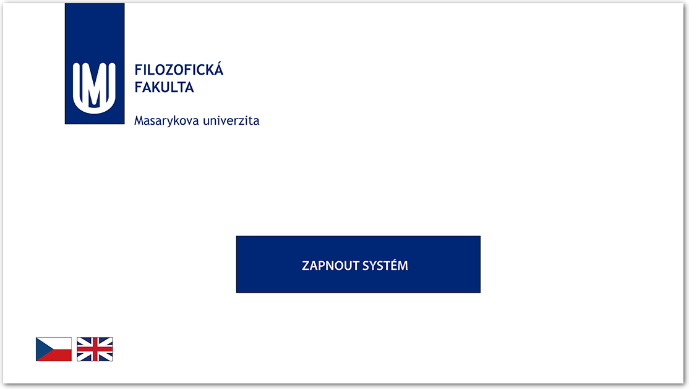
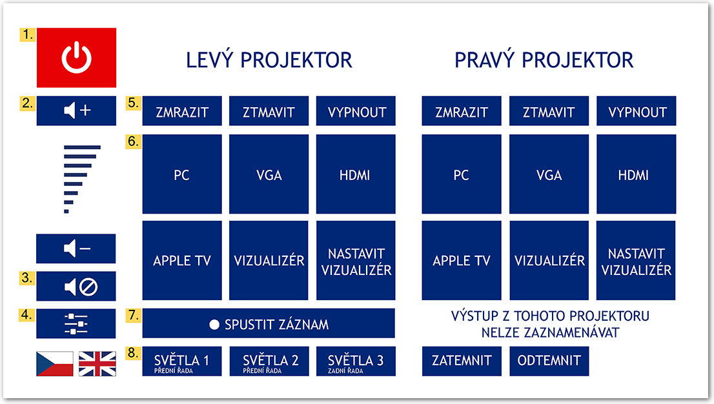
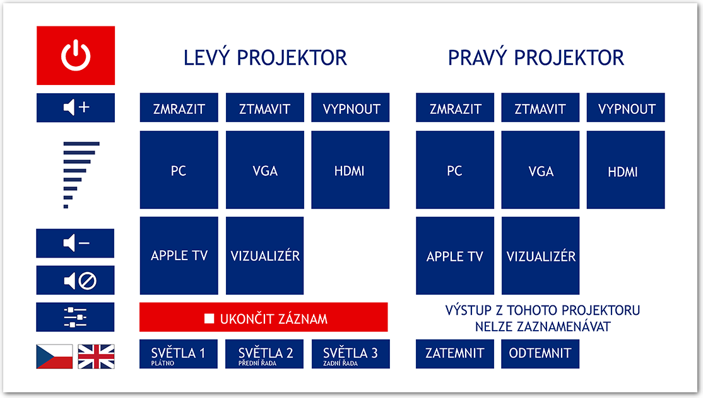
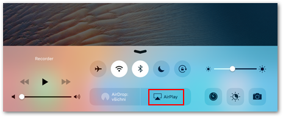
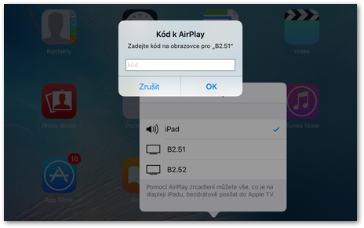

Dotykové panely
===============

>Návod platí pro učebny:
>
> -   **B2.13, B2. 23, B2.33, B2.44, B2.43, B2.34, B2.24,**
> -   **C34,**
> -   **D21, D31, D41,**
> -   **G22.**

Automatizované nahrávání je dostupné ve většině rekonstruovaných učeben
FF. Některé učebny jsou řešeny nahráváním pomocí [tlačítkových
panelů](/medialdocs/tlacitkove-panely), jiné pomocí dotykových panelů.
Oboje zařízení pak uživateli dovoluje jednoduše a pohodlně nahrávat svou
přednášku, včetně materiálů promítaných na plátně. Je však možné nahrát
přednášku i bez těchto materiálů. Tento návod se věnuje učebnám s
dotykovými panely.

## Zapnutí systému a popis ovládacího panelu

**Dotykový panel** je umístěn na katedře. Pokud je systém projektorů
vypnutý, uvidíte na něm tuto hlášku:

Obr. 1: Zapnutí systému

**Pozor!** Zapínání systému trvá několik minut. Projektory jsou však
nyní běžně užívány ve výuce, proto většinou bývá systém v chodu
nepřetržitě a není třeba jej zapínat a vypínat. 

V některých větších učebnách, jako je např. B2.13, je k dispozici výběr
ze dvou modů -- jednoduchá projekce (tzv. kino projekce) a dvojitá
projekce, viz obrázek 2. V těchto učebnách jsou tři projektory, v
případě jednoduché projekce je spuštěn jeden uprostřed a zabírá celý
promítací prostor. V případě dvojité projekce jsou pak spuštěny dva
krajní a plocha je pak rozdělena a na každé z nich může být jiný zdroj.

Obr. 2: Výběr z jednoduché nebo dvojité projekce

**Pozor!** Při dvojité projekci se nahrává pouze jeden vstup, a to ten,
pod kterým je na panelu umístěno tlačítko "Spustit záznam".

#### Popis tlačítkového panelu

Na dotykovém panelu můžete vidět tyto volby (obrázek je z dvojité
projekce, jednoduchá projekce je pak prosta pravé strany).

Obr. 3: Dotykový panel a jeho komponenty

1.  Tlačítko k vypnutí promítacího systému.
2.  Snížení a zvýšení hlasitosti. Pokud chcete změnit hlasitost, musíte
    dlouze podržet ikonu s reproduktorem + pro zesílení a s - pro
    zeslabení.
3.  Tímto tlačítkem vypínáte zvuk.
4.  Podrobnější nastavení zvuku.
5.  Umožňuje zmrazit, ztmavit nebo vypnout obraz z projektoru, aby
    ostatní neviděli, co právě děláte (např. při vyplňování
    přihlašovacích údajů).

-   Zmrazit -- promítaný obraz se zmrazí v daný moment, kdy stisknete
    tlačítko.
-   Ztmavit -- promítaný obraz se ztmaví.
-   Vypnout -- promítaný obraz se vypne (ale nevypne se promítací
    systém).

Zde si vybíráte vstup, ze kterého budou do promítací plochy proudit
informace. Bližší popis [viz
níže](/medialdocs/dotykove-panely#TOC-Volba-vstupu).

Zde spustíte nahrávání záznamu.

Zde můžete vypnout světla, aniž byste museli odbíhat od katedry.

### Ovládání záznamového zařízení

Při používání zařízení pro automatizovaný záznam postupujte následujícím
způsobem:

1.  Přihlaste se k počítači v učebně. Tlačítko **"Spustit záznam"** se
    aktivuje.
2.  Zapněte projektor a zvolte zdroj obrazu ([viz
    níže](/medialdocs/dotykove-panely#TOC-Volba-vstupu)).
3.  Stiskněte "Spustit záznam". Tlačítko se rozsvítí červeně na
    znamení, že probíhá nahrávání.
    **Pozor!** Zpracovány jsou pouze nahrávky, které trvají déle než
    jednu minutu. Kratší záznamy systém automaticky maže.
4.  Pro ukončení nahrávání stiskněte tlačítko "Ukončit záznam".
5.  Nahrávka se automaticky zpracuje a odešle do Vaší [osobní
    kategorie](/medialdocs/kdo-muaze-videt-muaj-obsah) ve fakultní
    knihovně médií [Medial](http://medial.phil.muni.cz/){:target="_blank"}. Jakmile bude
    video dostupné, obdržíte e-mail s odkazem.

Jak nastavit oprávnění ke zhlédnutí videa v Medialu či jak lze videa z
Medialu dále šířit se dozvíte v [uživatelské
dokumentaci](https://sites.google.com/a/phil.muni.cz/elearning-medial/){:target="_blank"}.
Mějte na paměti, že video se odešle do osobní složky v Medialu tomu
uživateli, který je během záznamu přihlášený na PC.

Videa z učeben v Medialu nemají vyplněné doplňující informace,
doporučujeme je proto [dodatečně
editovat](/medialdocs/jak-muazu-dodatecne-upravit-metadata), aby je bylo
možné v knihovně médií rozpoznat a dohledat.

Obr. 4: Právě probíhající záznam

**Poznámka.** Aby byl přednášející dobře slyšet, doporučujeme použít
některý z mikrofonů, které jsou v každé učebně k dispozici. Více o
mikrofonech se dozvíte v [patřičné sekci
dokumentace](/medialdocs/mikrofony).

Jak záznam vypadá? Přednášejícího snímá kamera napevno umístěná v
učebně. Je-li zapnutý projektor, vloží se obraz promítaný na plátno
přímo do videa, aby byla zajištěna dobrá čitelnost prezentací a jiných
výukových materiálů (obr. 2). Nahrávat lze i bez zapnutého projektoru,
video pak bude obsahovat jen obraz z učebny.

Obr. 5: Vzhled výsledného videa

### Volba vstupu

Můžete si vybrat, z jakého zdroje budete promítat na plátno. Na
dotykovém panelu máte několik možností: PC, VGA, HDMI, Apple TV a
vizualizér. Můžete si tak vybrat podle toho, co Vám nejvíce vyhovuje a
co nejvíce podporuje Vaše metody výuky.

#### PC -- projekce z počítače v učebně

Projekci z počítače umístěného na katedře aktivujete stisknutím
tlačítka **"PC"**.

#### VGA + HDMI -- projekce z vlastního notebooku

Vlastní notebook můžete připojit pomocí rozhraní VGA či HDMI. Potřebné
konektory naleznete v zásuvce zapuštěné v desce katedry. Po zapojení
konektoru do notebooku stiskněte příslušné tlačítko na ovládacím panelu.

Obr. 6: Konektory pro připojení vlastního notebooku

Rozhraní **HDMI **umožňuje přenášet zvuk i obraz v digitálním formátu.
Kvalita obrazu je zpravidla vyšší než u VGA, ovšem při přenosu může
docházet k drobným prodlevám.

Rozhraní **VGA **je starší analogový standard, který slouží pouze k
přenosu obrazu. Pro přenos zvuku je nutné zapojit zvlášť
konektor **audio jack**. Kvalita obrazu může být nižší než u HDMI.

#### Apple TV -- projekce ze zařízení Apple

Učebny v budovách A a B2 jsou vybaveny zařízením Apple TV, které
umožňuje umožňuje bezdrátový přenos obrazu ze zařízení Apple. Snadno tak
můžete promítat obraz například z vlastního iPadu nebo MacBooku. Pro
připojení k Apple TV postupujte následujícím způsobem:

1.  Stiskněte tlačítko "Apple TV" na ovládacím panelu.

2.  V ovládacím centru svého zařízení Apple stiskněte tlačítko
    "AirPlay".

    

    Obr. 7: Tlačítko AirPlay v ovládacím centru
    

3.  Zobrazí se Vám seznam dostupných zařízení, pojmenovaných podle
    učebny, ve které se nacházejí. Zvolte to, na které chcete obraz
    přenášet.

    

    Obr. 8: Seznam dostupných Apple TV
    

4.  Zadejte kód, který se Vám zobrazí na promítací ploše, a potvrďte
    stisknutím "Ok". Obě zařízení se následně spárují.

    

    Obr. 9: Pole pro zadání kódu k Apple TV

#### Vizualizér -- projekce z vizualizéru

Učebny v budovách A a B2 jsou vybaveny vizualizérem, který funguje jako
kamera snímající určité místo na katedře a umožňuje tak promítat
například materiály vytištěné na papíře. Vstup z vizualizéru zvolíte
tlačítkem **"Vizualizér**". Vizualizér je buď umístěný na kraji
katedry, nebo zavěšený přímo nad katedrou. Ovládat jej lze pomocí
dotykového panelu.

#### Nastavení vizualizéru

Ovládací rozhraní vizualizéru otevřete stisknutím tlačítka "Nastavení
vizualizéru" (viz obr. 3). Upravovat můžete přiblížení (Zoom),
zaostření a jas obrazu. Tlačítkem "Zmrazit" lze promítaný obraz
zafixovat.

Obr. 10: Nastavení vizualizéru

### Kontrola funkčnosti zařízení v učebně

Správnou funkčnost záznamového zařízení si můžete ověřit přímo v učebně.
Na ploše učitelského PC je umístěna ikona "OBS Studio", po jejím
rozkliknutí se otevře přehrávač okno s náhledem záznamu z učebny. Zde si
můžete zkontrolovat, zda je obraz kamery v pořádku, zda je obraz z
projektoru vložený do záznamu a také zda je zaznamenáván zvuk. Úroveň
snímaného zvuku je indikována vizuálně pomocí svítícího ukazatele pod
obrazem z učebny.

Pokud náhled není v pořádku, [kontaktuje](/medialdocs/kontakty) techniky
CIT.

Náhled streamu můžete na učitelském PC otevřít kdykoliv i bez toho,
abyste spouštěli samotný záznam.

### FAQ

**Co dělat, když záznam spustím nedopatřením?**

Ke zpracování se odesílají pouze záznamy, které trvají déle než minutu.
Pokud jste tedy záznam vypnuli dříve, nemusíte nic řešit. V opačném
případě můžete počkat, až se video zpracuje, a poté jej z mediální
knihovny [odstranit](/medialdocs/kde-najdu-vsechna-svoje-videa).

**Co se stane, když záznam zapomenu ukončit?**

Nic se neděje, nahrávání se samo ukončí poté, co se odhlásíte z počítače
nebo jej vypnete.

**Tlačítko "Záznam" je zašedlé a nereaguje.**

Ověřte, zda jste přihlášení na počítači v učebně.

**Tlačítko "Záznam" svítí, přestože ještě nikdo není přihlášený na
počítači.**

Propojení s účtem zřejmě nefunguje správně a Vaše video by mohlo být
přiřazeno někomu jinému. Pokud můžete, kontaktujte techniky CIT
(klapka **1542**). Pokud nezbývá čas a záznam nutně potřebujete, zkuste
se nejprve přihlásit a znovu odhlásit a po ukončení záznamu nám
[napište](https://it.muni.cz/phil/ke/kontakty#main){:target="_blank"} -- ověříme, že
záznam skončil ve správné kategorii.

**Nepřišel mi mail s informací o zpracování záznamu.**

Zkuste ještě chvíli počkat, zpracování záznamu může trvat i několik
hodin. Pokud mail nepřijde do druhého dne,
[napište](https://it.muni.cz/phil/ke/kontakty#main){:target="_blank"} nám mail a uveďte v
něm, kdy a v jaké učebně jste nahrávku pořizovali.

**Mohu v průběhu přednášky přepínat mezi vstupy? Odrazí se přepínání i
ve výsledném záznamu?**

Ano, v záznamu se vždy objeví právě ten vstup, který jste v dané chvíli
v učebně používali.
