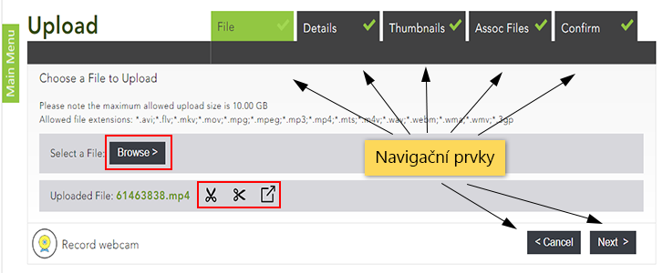

Úprava nahrávek
===============

I poté, co jste nahrávku do Medialu vložili, ji můžete poměrně volně
upravovat. V tomto návodu se dozvíte, jak dodatečně editovat veškeré
informace, které jste vyplnili při vkládání nahrávky do knihovny, jak
video ořezat nebo u nahrávky nastavit kapitoly.

## Editace metadat

  
<figcaption>Obr. 1: Tlačítko pro editaci metadat</figcaption>

Do rozhraní pro editaci metadat se dostanete ze stránky "[My
Content](/medialdocs/kde-najdu-vsechna-svoje-videa)" pomocí ikonky
tužky v pravém krajním sloupci. Editace Vám znovu zpřístupní formulář,
který jste vyplňovali při vkládání nahrávky, a umožní Vám veškeré údaje
změnit. Mezi jednotlivými položkami formuláře (podrobně jsou popsány
v [tomto návodu](/medialdocs/jak-nahrat-do-medialu-soubor-z-pocitace))
se můžete volně pohybovat pomocí záložek a navigačních tlačítek "Back"
(Zpět) a "Next" (Další). Editaci ukončíte kliknutím na tlačítko
"Finish" na záložce "Confirm".

**Pozor!** Pro uložení změn provedených na jednotlivých záložkách je
třeba kliknout na tlačítko "Next". Pouhým přepnutím na záložku
"Confirm" a stisknutím tlačítka "Finish" se změny neuloží.

  
<figcaption>Obr. 2: Rozhraní pro editaci</figcaption>

V rámci úprav můžete nahradit i soubor s nahrávkou -- například pokud
jste do Medialu vložili nesprávnou nahrávku nebo máte k dispozici její
novější verzi. Stačí na záložce "File" kliknout na tlačítko "Browse"
(pro výběr nového souboru z počítače) nebo "Record webcam" (pro
pořízení nového záznamu pomocí webkamery). Pomocí ikony nůžek vedle
názvu videa lze nahrávku ořezat, vyjmout některé části nebo exportovat.
Všechna vyplněná metadata zůstanou zachována. Nezapomeňte, že systém
bude muset nový soubor znovu zpracovat.

## Editace nahrávky

Po kliknutí na ikony nástrojů (viz obr.2), se otevře panel umožňující
editaci nahrávky. Zde můžete přepínat
mezi "Trim" (ořez), "Chop" (výřez), "Preview" (náhled)
a "Export" (uložení nahrávky).

  
<figcaption>Obr. 3: Editace nahrávky</figcaption>

1.  **Oříznutí videa** (Trim): Umožňuje odstranit část nahrávky z jejího
    začátku nebo konce. Zelené pole značí část nahrávky, která zůstane
    zachována. Tahem jednoho z posuvníků si délku nahrávky přizpůsobíte.
    Druhým způsobem, jakým lze oblast označit, je pomocí časového údaje.
    Do kolonky pod videem napíšete, od které vteřiny či minuty má video
    začít (*Start*) a kde se má ukončit (*End*). 
2.  **Výřez části videa** (Chop): Nechte nahrávku přehrát (nebo myší
    přetáhněte) do místa, které chcete vyjmout. Kliknutím na
    tlačítko *"*Add*" se *objeví modré pole, které značí, co bude
    z nahrávky odstraněno. Velikost modrého pole můžete přizpůsobit
    tahem myší nebo časovými údaji v kolonce. Úseků, které lze
    z nahrávky odstranit může být více. Stačí přetáhnout červený
    ukazatel na jinou část nahrávky a opět kliknout na
    tlačítko *"*Add". 
3.  **Náhled** (Preview): Slouží k náhledu, kde lze video přehrát a
    zkontrolovat jak výsledná nahrávka vypadá. Poté je možné se zpět
    vrátit k editace.
4.  **Export**: umožňuje uložit klip (nebo jeho části) jako samostatnou
    nahrávku do Medialu. Před uložením změn je tedy možné skrz ikonu
    export uložit části z původního videa beze změn. Obdobně jako u
    předchozích funkcí, přetáhnete červený ukazatel na potřebné místo v
    nahrávce a tlačítkem "Add" se žlutě označí část videa, která bude
    exportována.

Po kliknutí na tlačítko pro uložení "Save", vyskočí okno, kde máte
možnost upravit název editované nahrávky (Title on new version). Při
zakliknutí kolonky "Keep original video" se původní video, ve stavu
před editací, uloží jako nová nahrávka a zároveň lze upravit její název
(Title on original version) i kategorii, komu bude video přístupné
(Category for original version).

## Jak u nahrávek nastavit kapitoly 

U nahrávek, které již byly zpracovány a zpřístupněny v knihovně médií,
můžete nastavit také kapitoly umožňující divákům při přehrávání
přeskočit na předem daná místa. Kapitoly lze vytvářet na stránce pro
přehrávání videa:

1.  Přepněte na záložku "Chapters" umístěnou pod přehrávačem.
2.  Vyberte přístup k zobrazení kapitol (viz obr. 5) mezi "Global" (ke
    kapitolám budou mít přístup všichni, kteří mají přístup k videu) a
    "Private" (kapitoly budou přístupny pouze vám).
3.  Zastavte video v čase, pro který chcete nastavit začátek kapitoly, a
    stiskněte tlačítko "Start chapter".
4.  Nyní nahrávku zastavte v čase, kdy by měla kapitola končit, a
    stiskněte tlačítko "End chapter" případně "End/start chapter"
    pokud chcete navázat další kapitolou.
5.  Tlačítkem "Cancel" ukončíte editaci upravované kapitoly.  
      
    <figcaption>Obr. 4: Nastavení časových hranic kapitoly</figcaption>
6.  Pokud chcete kapitoly přenastavit nebo odstranit klikněte na
    popelnici pod kapitolou. Pokud jste s nastavením kapitoly spokojeni,
    můžete přidat *Název* kapitoly a *Popis*.
      
    <figcaption>Obr. 5: Finální nastavení kapitoly.</figcaption>
    
7.  Další kapitoly můžete přidávat stejným způsobem.

