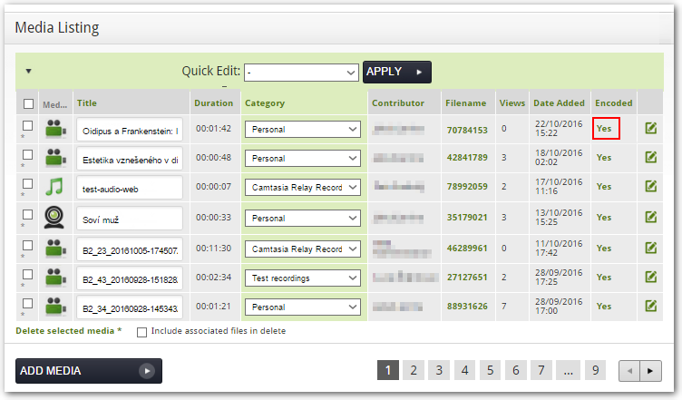
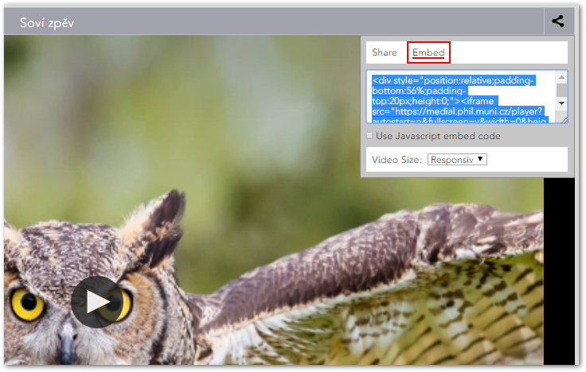

Sdílení obsahu
==============


Obsah Medialu není vázaný jen na mediální knihovnu jako takovou.
Nahrávky, ke kterým máte přístup -- tedy nejen své vlastní, ale i další
veřejné -- můžete několika různými způsoby šířit i mimo Medial. Při tom
je však třeba brát v potaz i další faktory, např. jste-li autorem
nahrávky, při jaké příležitosti jste záznam pořídili atd. 

#### Sdílení obsahu v Moodlu

Nahrávky z Medialu můžete snadno zveřejnit ve svých kurzech v Moodlu.
Díky propojení obou systémů mohou vkládat obsah do Moodlu jak učitelé,
tak studenti. Učitelé do Medialu vstupují pomocí [tlačítka v HTML
editoru](./propojeni-s-moodlem#TOC-P-stup-do-Medialu), studenti pak při
odevzdávání videa coby řešení úkolu. V obou případech se nejprve
zobrazí nabídka tří možností pro nahrání audiovizuálních materiálů do
Moodlu: první dvě možnosti ("Upload" a "Webcam") umožňují nahrát do
Medialu nový obsah a jsou popsány v [této části
dokumentace](./jak-vkladat-obsah-prostrednictvim-moodlu). Pokud chcete
do Moodlu vložit nahrávku, která již je v Medialu umístěná,
použijete tlačítko "Search".


Obr. 1: Tlačítko "Search" v Moodlu


Odtud se pak jednoduše dostanete ke všem videím, ke kterým máte v
Medialu přístup. Není tedy třeba nahrávky, které již v Medialu jsou,
opětovně nahrávat. Video, které chcete vložit, můžete dohledat pomocí
filtrů a vyhledávání.


Obr. 2: Filtrování, hledání správného videa


V rozhraní pro výběr videa lze využít tyto prvky:

1.  **Keyword search** (vyhledávání) -- umožňuje vyhledat zadaný řetězec
    v názvech a popiscích nahrávek, ve jménech autorů a tazích. Pro
    vyhledávání pomocí částečného řetězce je třeba použít zástupný
    symbol * (např. řetězec "*středověk**" vyhledá i videa se slovem
    *středověký*, *středověku* apod. v názvu).
2.  **Filter by** (filtry) -- můžete vybrat všechna média (**All
    media**), nebo moje média (**My media**), dále pak můžete filtrovat
    podle kategorií (nabídka **Category**) a autorů (nabídka
    **Contributor**). 
3.  Nápis v levé části sekce ukazuje, kolik videí odpovídá Vámi
    nastaveným filtrům (v tomto případě jde o 185 videí na 62
    stránkách). Pomocí číslovaných tlačítek můžete přecházet mezi
    jednotlivými stranami seznamu. Videa můžete seřadit podle data
    přidání (kliknutím na "Sort By Date", jde o implicitní řazení) či
    počtu zhlédnutí (kliknutím na "Sort By Views").
4.  Jakmile najdete Vámi požadované video, vyberte je kliknutím na
    tlačítko "Select". Tlačítkem "Preview" si můžete zobrazit náhled
    videa, tlačítkem "Edit Details" pak u svých videí vstoupíte do
    rozhraní pro [úpravu
    informací](./jak-muazu-dodatecne-upravit-metadata#TOC-Editace-metadat)
    o nahrávce.

```
<!-- -->
```

**Pozor!** Po zvolení konkrétního videa tlačítkem "Select" se zobrazí
možnost "Include Download Link", jejíž zaškrtnutí zpřístupní studentům
možnost stahování videa. Pokud si nepřejete, aby studenti Vaše video
mohli dále šířit (nahrávat na různé servery, YouTube apod.),
nedoporučujeme tuto možnost zaškrtávat.


Obr. 3: Tlačítko umožňující stažení videa studenty


V posledním kroku Vás Medial informuje o tom, že Vaše video je
připravené.


Obr. 4: Úspěšné vložení videa do Moodlu


#### Další možnosti sdílení

Další možnosti sdílení se Vám nabízejí na stránce pro přehrávání videa.
Dostanete se na ni po rozkliknutí nahrávky v knihovně videí nebo ze
stránky **My content**. V druhém případě klikněte u daného videa na
"Yes" ve sloupci Encoded (Stav zpracování, vizte obr. 5). 



Obr. 5: Kliknutím na "Yes" se dostanete na stránku pro přehrávání
videa


Aby Vaše video mohl vidět někdo jiný než vy, musíte nejprve povolit
veřejný přístup. V horním pravém rohu videa klikněte na ikonku sdílení
(1.) a následně zvolte "Enable public acces" (2.). 


Obr. 6: Povolení veřejného přístupu


Nastavení veřejného přístupu určuje, zda budou Vaše video moci zhlédnout
i ostatní, neovlivňuje však jeho viditelnost v samotné knihovně médií.
Pokud tedy u své nahrávky povolíte veřejný přístup a zároveň ji
ponecháte v kategorii Personal, nebude se zobrazovat v knihovně videí
Medialu ani ve výsledcích hledání, ovšem budou si ji moci zobrazit lidé,
kterým poskytnete odkaz.

**Pozor! **Jen video, které není privátní, lze sdílet. Videa umístěná v
jiných kategoriích, než je Personal, mají veřejný přístup automaticky
povolený a nelze je skrýt. U videí v kategorii Personal můžete veřejný
přístup dodatečně zrušit volbou "Disable public access".

Poté máte možnost vybrané video sdílet dále různými způsoby:

-   **Odkaz **-- odkaz je nejjednodušší variantou. Můžete jej jednoduše
    zkopírovat a poslat dále např. emailem, vložit na stránky, dokonce i
    do Moodlu. 


Obr. 7: Sdílení odkazu


-   **Embedovací kód** -- Medial automaticky vygeneruje embedovací kód,
    díky kterému pak můžete vložit dané video na vlastní webové stránky.
    Stačí kliknout na "Embed" a kód se automaticky vygeneruje. V
    roletce "Video Size" si můžete vybrat velikost vloženého videa..



Obr. 8: Cesta k embedovacímu kódu

-   **Download** -- své video si můžete stáhnout do vlastního počítače
    -- stačí kliknout levým tlačítkem myši na kód příslušného videa ve
    sloupci Filename a zvolit možnost "Uložit soubor" / "Save
    file".

[](./jak-muazu-sva-videa-sirit/sovi_zpev4.png?attredirects=0)

[](./jak-muazu-sva-videa-sirit/sovi_zpev4.png?attredirects=0)


Obr. 9: Stažení souboru.


Platnost odkazu i embedovacího kódu lze zpětně zrušit tím, že zakážete
veřejný přístup (volbou "Disable public acces").

**Poznámka.** Kódy pro sdílení naleznete i u videí, která jsou ve
veřejných kategoriích.

#### FAQ

**Musím video zveřejnit, než jej vložím do kurzu v Moodlu?**

Nemusíte. Vkládáte-li video do kurzu pomocí tlačítka Medial, účastníci
kurzu náležící k Filozofické fakultě k němu v rámci Moodlu automaticky
získají přístup. Mimo Moodle může video nadále zůstat nepřístupné.


**Pokud u videa povolím veřejný přístup, bude se zobrazovat v knihovně
videí?**

Nikoliv, povolením veřejného přístupu pouze zapnete možnost video
sdílet. Aby se zobrazovalo v knihovně videí, museli byste jej navíc
přesunout do některé z veřejných
[kategorií](./jak-je-obsah-v-medialu-organizovan#TOC-Kategorie-vide-).
Pokud video ponecháte v kategorii Personal, ostatní jej v Medialu
neuvidí.


**Pokud u videa zruším veřejný přístup, dostanou se k němu nadále lidé s
přímým odkazem?**

Nikoliv, zrušením veřejného přístupu se zruší i platnost odkazů a
embedovacího kódu. K vide se pak nedostanou ani lidé, kterým jste
poskytli přímý odkaz.
