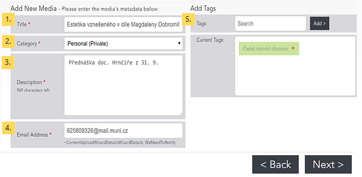
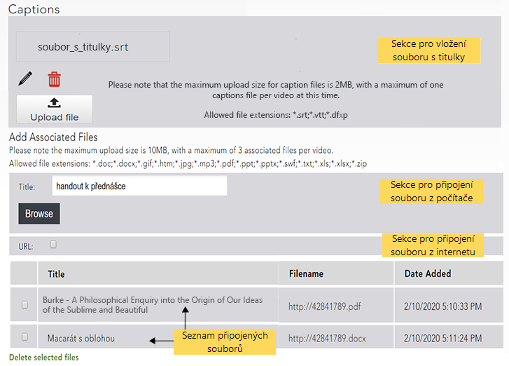

Nahrání souboru z počítače
==========================

2.  [**2** Doplňující informace
    (Details)](#TOC-Dopl-uj-c-informace-Details-)
3.  [**3** Náhledový obrázek
    (Thumbnails)](#TOC-N-hledov-obr-zek-Thumbnails-)
4.  [**4** Titulky a přidružené soubory (Assoc
    Files)](#TOC-Titulky-a-p-idru-en-soubory-Assoc-Files-)

####  

Do základního rozhraní pro vložení nahrávky se dostanete z úvodní
obrazovky knihovny pomocí volby "Upload" v navigační liště. Při
vkládání nahrávky je třeba projít pěti kroky, při nichž budete moci
nahrávku doplnit informacemi různého druhu. Mezi jednotlivými kroky lze
přecházet pomocí záložek v horní části nahrávacího rozhraní a všechny
informace lze po vložení nahrávky [dodatečně
editovat](/home/jak-muazu-dodatecne-upravit-metadata).

Obr. 1: Záložky umožňující přecházet mezi jednotlivými kroky

#### Výběr souboru z počítače

Obr. 2: Rozhraní pro výběr a vložení souboru

Na hlavní stránce knihovny videí klikněte na tlačítko "Upload" v
navigační liště, čímž se dostanete do rozhraní pro přidávání obsahu. Po
stisknutí tlačítka "Browse" se Vám otevře standardní souborový
manažer, ve kterém najdete a vyberete soubor, který chcete vložit.

**Poznámka.** Maximální velikost souboru, který chcete do Medialu
nahrát, je 10 GB. Podporovány jsou formáty AVI, FLV, MKV, MOV, MPG,
MPEG, MP3, MP4, M4V, MTS, WAV, WEBM, WMA, WMV a 3GP.

#### Doplňující informace (Details)

Obr. 3: Formulář pro zadání informací o nahrávce

Nyní je třeba vyplnit formulář s doplňujícími informacemi. Formulář
obsahuje jednotlivá pole pro:

1.  **Název nahrávky**
2.  **Kategorie** -- výběr kategorie určuje, pro koho bude nahrávka
    viditelná a přístupná
3.  **Popisek** -- stručná charakteristika nahrávky o délce max. 1000
    znaků; doporučujeme do popisku uvádět, kdy a při jaké příležitosti
    byla nahrávka pořízena (např. kód a název předmětu, jméno konference
    apod.), v ideálním případě pak využít naši [předpřipravenou
    šablonu](/home/jak-je-obsah-v-medialu-organizovan#TOC-Popisky).
4.  **E-mailová adresa** -- na zadanou adresu Vám budou chodit zprávy o
    zpracování nahrávky
5.  **Tagy** -- tagy, podle kterých mohou nahrávku dohledat ostatní
    uživatelé (jednotlivé tagy je nejprve nutné vepsat do textového pole
    a poté přidat do seznamu tlačítkem "Add")

Povinná pole jsou označena hvězdičkou, pečlivé vyplnění celého dotazníku
je nicméně nutné, pokud chcete, aby byla Vaše nahrávka snadno
rozpoznatelná a dohledatelná. Podrobnější informace o tom, jak fungují
kategorie a tagy, včetně našeho doporučení, jak je používat, naleznete v
návodu věnovaném [organizaci
obsahu](/home/jak-je-obsah-v-medialu-organizovan) knihovny.

#### Náhledový obrázek (Thumbnails)

Obr. 4: Výběr náhledového obrázku

V tomto kroku si můžete nastavit obrázek, který bude fungovat jako
náhled Vašeho videa. Na výběr máte několik návrhů vygenerovaných přímo z
videa, ovšem použít můžete i implicitní obrázek dané kategorie (je-li
pro kategorii nastavený) nebo obrázek vlastní. Pro vložení vlastního
náhledového obrázku stiskněte tlačítko "Browse" a vyberte požadovaný
obrázek ze svého počítače.

**Poznámka:** Obrázek musí být ve formátu PNG, JPG nebo GIF.
Doporučovaná velikost pro správné zobrazení náhledu je 640 na 385
pixelů.

#### Titulky a přidružené soubory (Assoc Files)

Obr 5: Vkládání titulků a přidružených souborů

Ke své nahrávce můžete připojit soubory dvojího druhu: jednak titulky,
které se budou zobrazovat v oknu přehrávače, a jednak doplňující soubory
v podobě obrázků, dokumentů či archivů se soubory.

Pokud chcete **vložit titulky**, klikněte na tlačítko "Browse" a
vyberte soubor s titulky ze svého počítače. Titulky musí být ve formátu
SRT, VTT nebo DFXP. Pro správné zobrazení znaků české abecedy je třeba
soubor s titulky uložit s kódováním UTF-8.

Zobrazování titulků při přehrávání lze přepínat pomocí tlačítka "CC" v
pravé spodní části okna přehrávače.

Vložený soubor s titulky můžete smazat kliknutím na obrázek popelnice -
"Delete caption file".

**Poznámka:** Ke každé nahrávce lze připojit pouze jeden soubor s
titulky. Medial také neumožňuje dodatečně titulky editovat či
synchronizovat, ujistěte se proto ještě před vložením titulků, že jsou
správně časovány.

Při **vkládání přidružených souborů** je nutné nejprve vyplnit jméno,
pod kterým se bude přidružený soubor zobrazovat, do pole Title. Poté
klikněte na tlačítko "Browse" a vyberte soubor, který chcete
k nahrávce připojit. Zaškrtnete-li volbu **URL**, budete moci použít
soubor umístěný na internetu. Stačí do textového pole zkopírovat
internetovou adresu souboru a potvrdit stisknutím tlačítka "Add".

Takto lze ke každé nahrávce přidružit až tři soubory. Přidružené soubory
po vložení videa zobrazíte kliknutím na záložku "Resources" umístěnou
pod přehrávačem.

Pro odstranění souborů vyberte soubory, které chcete smazat, pomocí
zaškrtávacího políčka v levém sloupci a klikněte na "Delete selected
files".

**Poznámka:** Přidružit lze soubory ve formátu DOC, DOCX, GIF, HTM, JPG,
MP3, PDF, PPT, PPTX, SWF, TXT, XLS, XLSX a ZIP.

#### Potvrzení (Confirm)

Poslední krok je přehledným shrnutím vlastností nahrávky. Pokud chcete
nějaké informace doplnit či upravit, můžete se vrátit k předchozím
krokům pomocí tlačítka "Back" nebo pomocí záložek v horní části
nahrávacího rozhraní. Pokud jste s informacemi o nahrávce spokojeni,
potvrďte její vložení kliknutím na tlačítko "Finish".

**Pozor!** Po vložení do Medialu nebude Vaše nahrávka ihned přístupná.
Každý vložený soubor prochází zpracováním, které trvá různou dobu v
závislosti na velikosti souboru a vytížení systému. O dokončení
zpracování budete informováni e-mailem.

#### Časté dotazy (FAQ)

**Mohou do Medialu nahrávat obsah i studenti? Kdo jej uvidí?**

Studenti mohou do Medialu přidávat obsah, ale pouze do své osobní
kategorie. Jejich nahrávky se tedy nebudou zobrazovat ostatním
uživatelům Medialu, mohou je nicméně dále [sdílet mimo knihovnu
médií](/home/jak-muazu-sva-videa-sirit).
