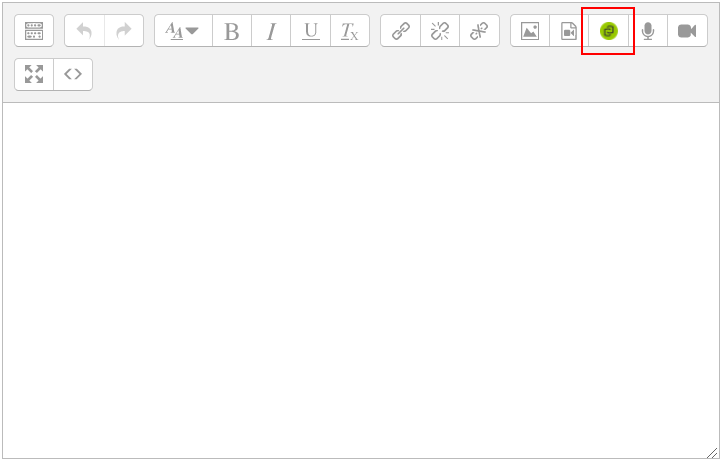
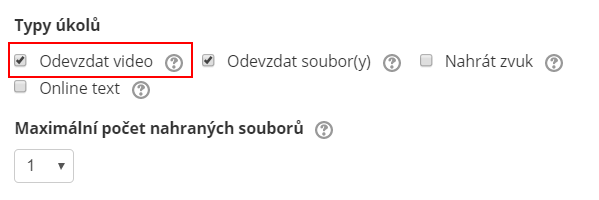
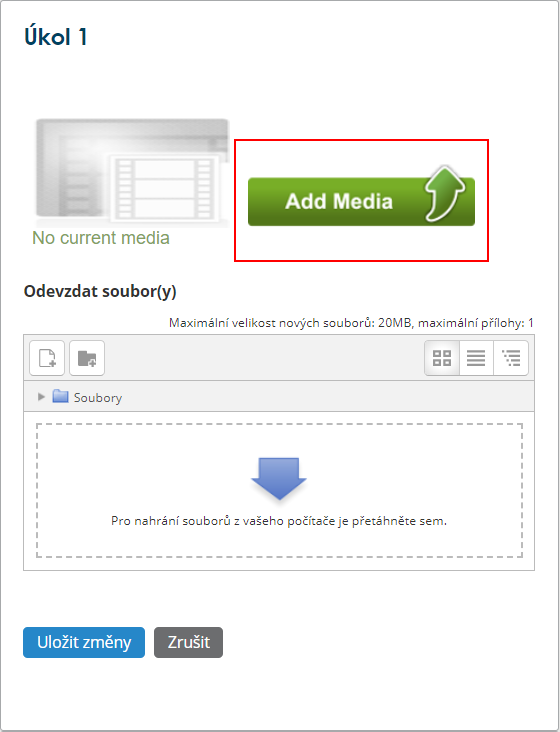
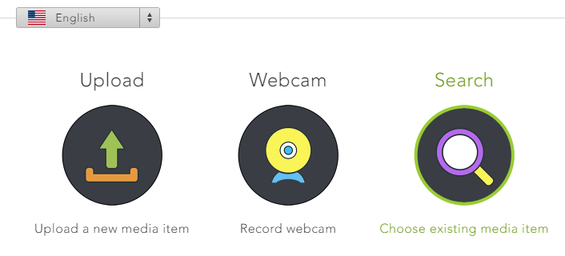

Vkládání obsahu prostřednictvím Moodlu
======================================

2.  [**2** Odevzdání úkolu ve formě
    videa](#TOC-Odevzd-n-kolu-ve-form-videa)

Díky [propojení Medialu s Moodlem](/home/propojeni-s-moodlem) můžete
vkládat multimediální obsah přímo ze svého kurzu. Jako učitel využijete
vkládání pomocí tlačítka v HTML editoru, naopak studenti Medial využijí
při odevzdávání úkolů ve formě videosouborů.

**Poznámka: **Před prvním vstupem do Medialu je potřeba propojit oba
profily. Stačí, když [se přihlásíte](/home/propojeni-s-moodlem) pomocí
svého UČO a sekundárního hesla. 

#### Tlačítko Medialu v editoru

Jako učitelé můžete do Moodlu vložit videa na většině míst, kde se
používá HTML editor (tedy např. do poznámky, knihy, testu...). Stačí
jen kliknout na zelenou ikonku Medialu (obr. 1), pomocí níž se dostanete
se do zjednodušeného rozhraní Medialu. Další krok pak naleznete níže v
tomto návodu.

Obr. 1: Zelená ikonka Medialu v panelu editoru.

#### Odevzdání úkolu ve formě videa

Studentům můžete zadat, aby odevzdali nahrávku z Medialu coby řešení
úkolu -- stačí v nastavení typu úkolu zaškrtnout možnost **Odevzdat
video.**

**

Obr. 2: Natavení typu úkolu.

Po kliknutí na "Odevzdat řešení úkolu" se pak studentům zobrazí
tlačítko "Add Media" (obr. 2), pomocí kterého se dostanou do
zjednodušeného rozhraní Medialu, popsaného níže.

Obr. 3: Tlačítko pro odevzdání úkolu v podobě videa

#### Vložení videa

Ať už vstupujete do Medialu pomocí HTML editoru nebo pomocí modulu Úkol,
zobrazí se Vám nejprve nabídka tří možností pro nahrání materiálů do
Moodlu.

Obr. 4: Možnosti vložení videomateriálu.

První dvě volby umožňují nahrát do Medialu (a zároveň s tím i do Vašeho
kurzu) nový obsah. Postup je v obou případech stejný jako při vkládání z
webového rozhraní mediální knihovny:

-   **Upload** -- umožňuje vložit audio- či videosoubor z počítače,
    podrobný návod [naleznete
    zde](/home/jak-nahrat-do-medialu-soubor-z-pocitace).
-   **Webcam** -- umožňuje vytvořit obsah na místě pomocí webkamery nebo
    mikrofonu (tedy jak audio, tak i video), podrobný návod [naleznete
    na tomto odkazu](/home/jan-nahrat-video-pomoci-webkamery).

Volba **Search** umožňuje procházet již existující obsah mediální
knihovny a vkládat jej do kurzu; v tomto bodě se Vám ukážou nejen Vaše
osobní videa, ale i videa z veřejných kategorií. Více se můžete dozvědět
[v tomto návodu](/home/jak-muazu-sva-videa-sirit).
