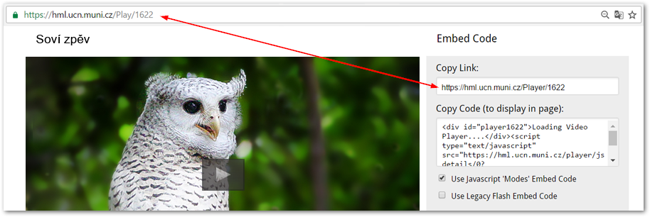

Jak získat odkazy
=================

#### Sdílení kategorií, tagů a autorů

V Medialu se můžete dostat i ke specifickým URL adresám, které odkazují
např. k daným kategoriím, tagům, případně přímo k autorům. URL adresy se
Vám vždy zobrazují, když vstoupíte na danou stránku. Stejně tak je to i
v Medialu. Tyto URL adresy můžete sdílet s dalšími lidmi, a pokud
nepatří k videím pod private kategorii, mohou si je prohlédnout i lidé,
kteří v Medialu nemají účet, nebo nejsou přihlášení. Tímto způsobem
můžete tedy např. poslat odkaz na všechna Vaše videa. URL adresa
většinou začíná řetězcem https://hml.ucn.muni.cz/Browse/..., a následují
další položky. Při odkazu k Vašim videím by pokračoval dále
/Contributor/VašeJméno. (Je to třeba, není to zmatečné?)

Mám přidat další příklady?

Tohle je trochu zmateční. URL videa není problém, Medial ji člověku
vyhodí na očekávatelném místě (jako je to na screenu). Problém je adresa
kategorií, tagů a autorů, protože při výběru některého z nich v knihovně
videí zůstává URL v adresním řádku prohlížeče stejná. URL je potřeba
získat oklikou, a proto by bylo dobré mít na to návod, ideálně rozepsaný
zvlášť pro každý případ (tj. jak získat adresu kategorie, jak tagu, jak
autora). Nevím, jestli se ti s tím chce babrat, uvažuju, že bysme pak
dodělali ještě návod na tvoření playlistů, kam by se to asi hodilo víc.
Kdyby to bylo zpracováno už tady, tak bysme to pak mohli jen přesunout,
ale nechám rozhodnutí na tobě.

> Obr. 8: URL adresa je shodná s tou, kterou kopírujete a šíříte, stejná
> Vám také dojde do e-mailu.
