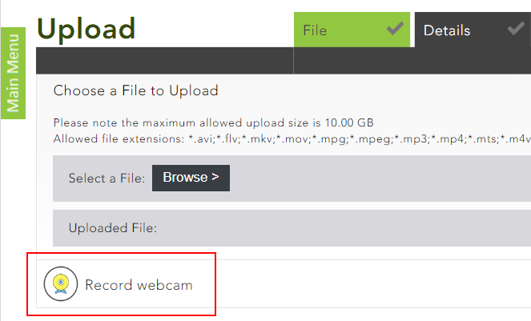
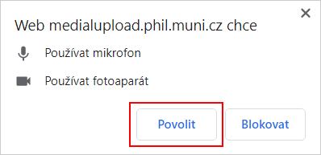
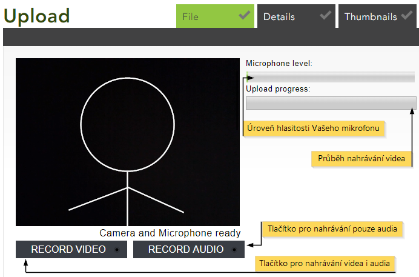
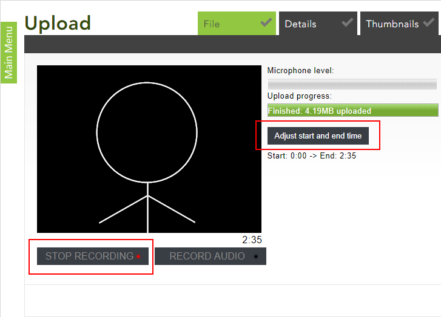
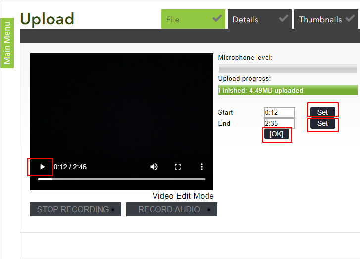

Záznam pomocí webkamery
=======================

#### Nutné kroky před nahráváním

Pokud chcete vytvořit vlastní obsah rovnou, můžete natočit video- nebo
audiozáznam pomocí vlastní webkamery či mikrofonu.

Po přihlášení do Medialu si pomocí tlačítka "Upload" na hlavní straně
knihovny videí otevřete rozhraní pro přidávání obsahu. Zde uvidíte nápis
"Record webcam". Klikněte na něj.

> Obr. 1: Výběr nahrávání pomocí webkamery
> 

V dalším kroku musíte Medialu povolit přístup k Vaší kameře a mikrofonu.

> Obr. 2: Povolení přístupu

#### Rozhraní pro nahrávání

#### 

> Obr. 3: Základní rozhraní při nahrávání
> 

Úroveň hlasitosti Vašeho mikrofonu se zobrazuje v panelu napravo.
Zároveň také ukazuje jeho funkčnost.

Pod úrovní hlasitosti se nachází ukazatel, ve kterém uvidíte narůstající
velikost videa v MB. Délka videa se po stisknutí tlačítka pro nahrávání
ukáže přímo pod videem (místo nápisu *Camera and Microphone ready* viz
obr. 4).

Při nahrávání si můžete vybrat, zda budete **zaznamenávat video včetně
zvuku** (kliknete na "Record video"), nebo **pouze zvuk** (kliknete na
"Record audio").

#### Upravení délky nahrávky

Po pár sekundách nahrávání se Vám zobrazí tlačítko "Stop". Tímto
tlačítkem záznam ukončíte. 

> Obr. 4: Kroky po dokončení nahrávání
> 

Následně se objeví tlačítko "Adjust start and end time", které Vám
umožní přehrát nahrávku a případně změnit její počáteční a koncový čas.

> Obr. 5:Úprava začátku a konce videa
>
> 

Záznam přehrajete pomocí tlačítka play. Začátek a konec videa můžete
upravit zadáním konkrétního času do příslušné kolonky (*Start* pro
začátek a *End* pro konec), nebo během přehrávání videa. Po spuštění
videa kliknete na tlačítko "Set" (pro upravení začátku vedle kolonky
*Start*, pro upravení konce vedle kolonky *End*) ve chvíli, kdy chcete,
aby nahrávka začínala a končila.

V momentě, kdy celková stopáž vyhovuje Vašim požadavkům, uložíte změny
tlačítkem "[OK]".

#### Dokončení nahrávání

Pokud jste se záznamem spokojeni, můžete se posunout dále tlačítkem
"Next". V dalších krocích bude nutné vyplnit podrobnosti o nahrávce.
Postup je stejný jako při vkládání souboru z počítače a je podrobně
popsán v [tomto návodu](/home/jak-nahrat-do-medialu-soubor-z-pocitace).
