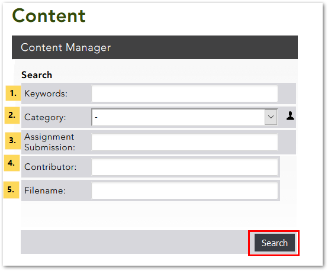
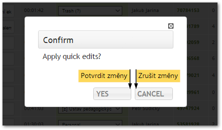

Stránka Můj obsah
=================

2.  [**2** Hledání a filtrování
    nahrávek](#TOC-Hled-n-a-filtrov-n-nahr-vek)

#### Co je stránka My Content 

Stránka **My Content** (Můj obsah) v sobě zahrnuje přehled veškerého
Vašeho obsahu v Medialu a umožňuje Vám tento obsah spravovat.

Z knihovny videí se na stránku My Content dostanete kliknutím na
tlačítko "My Account" (v pravo nahoře) a výběrem možnosti "My
Content" z rozbalovací nabídky.

Obr. 1: Odkaz na stánku My Content v knihovně videí

#### Hledání a filtrování nahrávek

Obr. 3: Formulář pro vyhledávání a filtrování

Sekce **Search** (Hledání) v horní části stránky Vám umožní prohledávat
a filtrovat seznam svých nahrávek podle několika různých parametrů.
Využijete ji tedy především, pokud máte v Medialu nahrané větší množství
obsahu. Pro filtrování můžete využít následující položky:

1.  **Klíčová slova** -- vyhledá zadaný text v názvech a popiscích
    nahrávek
2.  **Kategorie** -- zobrazí jen nahrávky patřící do zvolené kategorie
3.  **Zadání úkolu** -- zobrazí nahrávky, které studenti odevzdi v rámci
    úkolu
4.  **Autor** -- vyhledá zadaný text ve jménech autorů nahrávek
5.  **Název souboru** -- vyhledá zadaný text v názvech souborů

**Poznámka:** Při filtrování je možné použít i části slov. Velikost
písmen nehraje roli. Je ale nutné použít zástupný znak "*". Dotaz
"lišk*" Vám tedy vyhledá i řetězce jako "liška", "lišky",
"Lišková" apod.

Po kliknutí na tlačítko "Search" se Vám v seznamu nahrávek zobrazí
pouze ty, které odpovídají nastaveným parametrům.

#### Prohlížení a správa obsahu

        Obr. 4: Seznam nahrávek

V sekci **Media Listing** (Seznam médií) naleznete přehledný soupis
všech svých videí a zvukových nahrávek. Jednotlivé sloupce obsahují
podrobnější informace o každé nahrávce:

1.  **Typ média** -- různé ikonky v tomto sloupci označují audio- a
    video soubory vložené z počítače a nahrávky pořízené pomocí
    webkamery nebo mikrofonu; kliknutím na ikonku lze nahrávku přehrát
2.  **Název nahrávky**
3.  **Doba trvání**
4.  **Kategorie**
5.  **Autor** -- jméno uživatele, který nahrávku do knihovny vložil
6.  **Název souboru** -- uvádí název, pod kterým je soubor s nahrávkou
    uložen v Medialu (liší se od původního názvu souboru), po kliknutí
    na název lze soubor s videem stáhnout
7.  **Počet zhlédnutí nahrávky**
8.  **Datum a čas vložení nahrávky**
9.  **Stav zpracování** -- ukazuje průběh zpracování nahrávky, u již
    zpracovaných nahrávek se zobrazí zelený nápis "Yes"

Kliknutím na nadpisy v záhlaví jednotlivých sloupců seznam seřadíte
podle daného atributu. Chcete-li například nahrávky seřadit od nejdelší
po nejkratší, klikněte na nadpis "Duration".

Přímo v soupisu můžete také rychle a jednoduše provádět základní úpravy
nahrávek:

-   pro **změnu názvu** nahrávky vepište nový název do textového pole ve
    sloupci "Title" a potvrďte tlačítkem "Apply"
-   pro **změnu kategorie** vyberte novou kategorii z rozbalovací
    nabídky ve sloupci "Category"
    a potvrďte tlačítkem "Apply"
-   pro **hromadnou změnu kategorie** u více videí vyberte patřičná
    videa pomocí zaškrtávacích políček vlevo a vyberte novou kategorii z
    rozbalovací nabídky v horní části soupisu a potvrďte tlačítkem
    "Apply"

**Pozor!** Veškeré provedené změny je třeba uložit stisknutím tlačítka
"Apply"!

Medial Vás ještě požádá o potvrzení, zda skutečně chcete provedené změny
aplikovat. Kliknutím na tlačítko "Yes" změny potvrdíte, kliknutím na
tlačítko "Cancel" zrušíte.

Obr. 5: Dialogové okno pro potvrzení provedených změn

V neposlední řadě je na stránce My Content možné nahrávky také
**smazat**: stačí označit nahrávky, které chcete odstranit, pomocí
zaškrtávacího políčka vlevo a kliknut na "Delete selected media".
Následně budete opět vyzváni k potvrzení svého rozhodnutí.

Medial umožňuje dodatečně upravovat i další podrobnosti o nahrávce jako
tagy nebo náhledové obrázky. Jak na to se dozvíte v [tomto
návodu](/medialdocs/jak-muazu-dodatecne-upravit-metadata).
