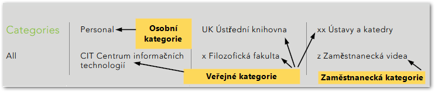

Kdo může vidět můj obsah
========================

Dostupnost vašich videí v Medialu se odvíjí od toho, v jaké kategorii
jsou umístěná. V současnosti se nabízejí tři možnosti: nahrávky mohou
být veřejně dostupné, omezené pouze pro zaměstnance konkrétního
pracoviště, nebo zcela soukromé.

  
Obr. 1: Seznam kategorií

Z hlediska viditelnosti obsahu pracuje Medial s kategoriemi trojího
druhu:

-   **Veřejné kategorie** -- patří sem fakultní veřejné
    kategorie (označované symbolem *x*), veřejné kategorie ústavů a
    kateder (označované dvěma křížky: *xx*) a veřejné kategorie
    neakademických pracovišť (označované zkratkou pracoviště v hranatých
    závorkách); nahrávky zařazené do těchto kategorií uvidí všichni
    uživatelé Medialu včetně nepřihlášených hostů.
-   **Zaměstnanecké kategorie** -- jsou označeny symbolem *z*. Jsou
    určeny pro obsah spojený s interní činností jednotlivých pracovišť.
    Vaše videa v této kategorii tedy uvidí pouze zaměstnanci daného
    pracoviště (spravovat je však nadále může pouze jejich vlastník
    (Contributor).
-   **Osobní kategorie** (Personal) -- jde o Váš soukromý prostor, jehož
    obsah se nezobrazuje na domovské stránce knihovny a je ostatním
    uživatelům Medialu nepřístupný. I nahrávky z této kategorie však
    můžete sdílet tak, že je vložíte do Moodlu nebo na vlastní webové
    stránky, případně zveřejníte jejich URL. Jak na to se dozvíte v
    [tomto návodu](/medialdocs/jak-muazu-sva-videa-sirit). Do této
    kategorie budou také odeslána videa pořízená pomocí automatizovaného
    záznamového zařízení v učebnách a pomoci nástroje [Techsmith
    Relay](https://sites.google.com/a/phil.muni.cz/elearning-relay/){:target="_blank"}.

Kategorii můžete svému videu nastavit již při vkládání do Medialu v
rámci vyplňování podrobností o nahrávce. Celý tento proces je podrobně
[popsán zde](/medialdocs/jak-nahrat-do-medialu-soubor-z-pocitace).
Dodatečně pak můžete každému videu kategorii změnit na stránce "My
Content" -- jak postupovat se dozvíte v [tomto
návodu](/medialdocs/kde-najdu-vsechna-svoje-videa).

Celý systém kategorií je pak podrobněji popsán na [stránce o organizaci
obsahu knihovny](/medialdocs/jak-je-obsah-v-medialu-organizovan).
