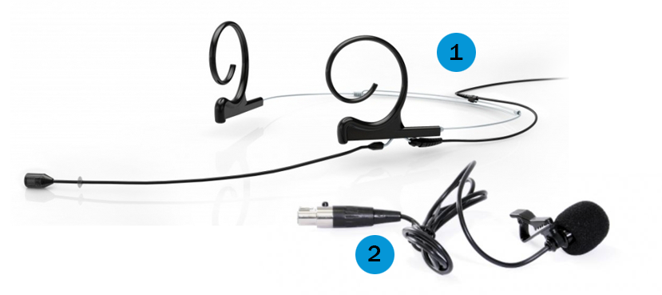

Mikrofony
=========

Pokud chcete, aby Vaše nahrávka měla kvalitní zvuk, doporučujeme Vám
používat mikrofony. Ty jsou dostupné v každé učebně komplexu CARLA (tedy
v učebnách, jejichž název začíná na A a B2). 

V učebnách můžete najít čtyři typy mikrofonů:

-   **Ruchový mikrofon** -- jeho umístění se liší, nejčastěji se nachází
    na katedře nebo u kamery. Zapíná se automaticky, pokud pokud není
    aktivní žádný jiný mikrofon. Musíte mít však na paměti, že je
    nejméně kvalitní a pokud nestojíte přímo u něj, nelze zaručit
    srozumitelnost zvukové části nahrávky.
-   **Ruční mikrofon** -- je nutné jej neustále držet v ruce, výsledný
    záznam je však kvalitnější.
-   **Klopový mikrofon** -- připíná se na oblečení, zvukový záznam je
    kvalitnější než u ruchového mikrofonu, může však být slyšet rušivé
    tření o textil.
-   **Náhlavní mikrofon** -- nasazuje se za uši, je lehký a dá se
    nastavit na velikost hlavy; k jeho přednostem patří vedle vysoké
    kvality zvuku i to, že přednášející může zapomenout, že jej má.

V každé učebně vybavené záznamovým zařízením najdete náhlavní nebo
klopový mikrofon. V některých učebnách je navíc k dispozici i mikrofon
ruční.

V učebnách **doporučujeme využívat primárně náhlavní a klopové
mikrofony**, které poskytují nejvyšší kvalitu zvuku. Ruční mikrofon
využijete především ve chvíli, kdy si mikrofon potřebuje předávat více
mluvčích.

##Kde jsou mikrofony umístěny 

Mikrofony jsou umístěny v boční skříňce katedry, kterou otevřete pomocí
přístupové karty učebny nebo své karty ISIC, případně pomocí klíčku,
který dostanete spolu s klíči od učebny. V některých učebnách jsou
mikrofony uloženy přímo na katedře (B2.13) nebo v samostatné skříňce
(C33).

##Jak mikrofony vypadají a jak se používají?

### Ruční mikrofon

Ruční mikrofon (neboli handka) se skládá z hlavy mikrofonu (1), tlačítka
na ztišení mikrofonu s nápisem (2), dále pak z těla mikrofonu (3),
displeje (4), který zobrazuje mj. informace o stavu baterie, a antény
mikrofonu (5). Mikrofon držte tak, abyste nepřekrývali anténu a displej.

[
Obr. 1: Handka, zdroj: oficiální manuál firmy [Sennheiser](https://en-us.sennheiser.com/global-downloads/file/6403/SKM_300_EN_INT.pdf){:target="_blank"}.

#### Budovy A a B 

Ruční mikrofon se zapíná dlouhým podržením červeného tlačítka na spodní
straně těla mikrofonu (viz obr. 2). Jakmile je zapnut, rozsvítí se jeho
displej oranžově. Důležité je, aby tlačítko s nápisem MIC svítilo
červeně -- pokud nesvítí, mikrofon je ztišen (MUTE). Ztišený mikrofon
nepřenáší žádný signál, tudíž nebude na nahrávce slyšet.

Obr. 2: Zapínání a vypínání mikrofonu, zvětšenina antény. Zdroj:
oficiální manuál
firmy [Sennheiser](https://en-us.sennheiser.com/global-downloads/file/6403/SKM_300_EN_INT.pdf){:target="_blank"}.

#### Budovy C, D, G, J, M a N

Ruční mikrofon se zpravidla aktivuje sám po vytažení z nabíjecí stanice.
Vyčkejte několik vteřin, než dioda pod displejem mikrofonu zezelená.

Pokud dioda nesvítí, zapněte mikrofon krátkým **stisknutím tlačítka
ON/OFF** na spodní straně těla  mikrofonu.

Svítí-li dioda žlutě, mikrofon je ztišený. Do provozu jej uvedete
**tlačítkem MUTE** pod displejem mikrofonu. Stejným tlačítkem můžete
mikrofon ztišit v průběhu přednášky.

Pro vypnutí mikrofonu přidržte dlouze tlačítko ON/OFF na spodní straně
těla mikrofonu.

Obr. 3: Ovládací prvky mikrofonu v učebnách C, D, G, J, M a N. Zdroj:
oficiální manuál firmy Sennheiser.

### Náhlavní a klopový mikrofon

Oba tyto mikrofony, které můžete vidět na obrázku 3, jsou připojeny k přijímači,
který lze umístit za pásek případně do kapsy. Náhlavní mikrofon (1) si
jednoduše nasadíte na uši tak, aby samotný mikrofon byl umístěn asi 3 cm
od úst.

Klopový mikrofon (2) klipsou přichytíte k oblečení (nejlépe k lemu
košile nebo trička), v ideálním případě by neměl třít o látku. 

Obr. 4: Mikrofony -- náhlavní (1) a klopový (2). Zdroj: oficiální manuál
firmy [Sennheiser](https://en-us.sennheiser.com/global-downloads/file/1909/SK100G3_Instructionsforuse.pdf){:target="_blank"}.

Ovládací prvky náhlavního a klopového mikrofonu jsou umístěny na
přijímači. Typ přijímače se liší podle budovy.

#### Budovy A a B 

Přijímač otevřete pomocí dvou tlačítek (1), která zmáčknete zároveň.
Tímto se uvolní kryt na baterii (2), který odhalí zapínání a vypínání
(4). Tlačítko "ON" / "OFF" stačí chvíli podržet a zařízení se zapne
(a vice versa). Rozsvítí se display (5), na kterém vidíte informace o
mikrofonu. Pro Vás jako uživatele jsou důležité dva údaje -- je-li
mikrofon ztišen (pokud je mikrofon ztišen, svítí na displayi nápis MUTE,
hlasitost upravíte páčkou na horní části přijímače v bodě 3), a jaký je
stav nabití baterie (klasická ikona baterie s ubývajícími články). Pokud
je baterie slabá, bude blikat červená dioda (6) a je nutné zavolat
technika, aby Vám dal jiný přijímač.

Obr. 5: Schéma přijímače. Zdroj: oficiální manuál firmy
[Sennheiser](https://en-us.sennheiser.com/global-downloads/file/1909/SK100G3_Instructionsforuse.pdf){:target="_blank"}.

#### Budovy C, D, G, J, M a N

Mikrofon se zpravidla aktivuje sám po vytažení z nabíjecí stanice.
Vyčkejte několik vteřin, než dioda na vrchní straně přijímače (2)
zezelená.

Pokud se dioda nerozsvítí, zapněte mikrofon **krátkým stisknutím
tlačítka ON/OFF** (1).

Svítí-li dioda žlutě, mikrofon je ztišený. Do provozu jej uvedete
přepnutím **tlačítka MUTE** (3) na horní straně přijímače. Stejným
tlačítkem můžete mikrofon ztišit v průběhu přednášky.

Pro vypnutí mikrofonu dlouze přidržte tlačítko ON/OFF (1).

Obr. 6: Ovládací prvky přijímače v budovách C, D, G, J, M a N.

#### Budovy K a L

Některé učebny v budovách K a L jsou vybaveny bezdrátovým klopovým
mikrofonem. Mikrofon je zapojený do katederního PC a lze jej použít v
aplikacích spuštěných na tomto počítači (typicky videokonferenční
aplikace).

Které učebny jsou mikrofony vybavené, můžete zjistit v [katalogu učeben
FF MU](https://www.phil.muni.cz/zamestnanec/katalog-uceben){:target="_blank"}.

Bezdrátový mikrofon zapnete i vypnete přidržením **tlačítka ON/OFF** na
boku přijímače (obr. 7, bod 1).

Obr. 7: Tlačítko pro zapnutí/vypnutí mikrofonů v budovách K a L.

### Jak mikrofony správně umístit do adaptéru

Mikrofony je třeba umístit do nabíječky tak, aby diody na nabíječce
svítily (viz červené diody na obr. 5). Pokud dioda nesvítí,
zkontrolujte, zda není mikrofon není v držáku posazený na volno, nebo
jej zkuste otočit. Po každém použití je třeba vložit mikrofon do
nabíječky, aby se dobil a byl připraven pro další použití.

Červená dioda znamená, že mikrofon se dobíjí, naopak zelená ukazuje, že
mikrofon je zcela nabitý a jeho baterie vydrží celou přednášku.

[
Obr. 8: Nabíječka s mikrofony. Zdroj: [dm
music](http://www.dmmusic.com/sennheiser-l2015-base-charger-unit){:target="_blank"}.

### FAQ

**Co dělat, když je mikrofon vybitý, svítí červeně nebo nefunguje
vůbec?**

Pokud nastane jakýkoliv problém, ozvěte se správci AV techniky Petru
Čučkovi na tel. 777 364 127 a popište mu svůj problém. Poté Vám přijde
některý z techniků pomoci.

**Mikrofon není na daných místech. Co dělat?**

Oznamte tento problém správci AV techniky Petru Čučkovi, kterého
naleznete na tel. čísle 777 364 127.
**
**

**Co dělat, když mikrofon vydává nepříjemné zvuky?**

Mikrofon může občas "chytat" zpětnou vazbu. Pokud se Vám něco takového
přihodí, zkuste nejprve na [dotykovém
panelu](/medialdocs/dotykove-panely) zeslabit zvuk. V případě, že se nic
nezmění, můžete vyzkoušet jiný mikrofon. Jsou dvě skutečnosti, které
mohou tento jev způsobovat: buď jste se s mikrofonem příliš přiblížili
reproduktorům, nebo je špatně nastavena citlivost mikrofonu. Pokud ani
po změně pozice a následném zeslabení mikrofonu na dotykovém displeji
nepříjemný zvuk zpětné vazby nepřestane, zavolejte správci AV techniky
Petru Čučkovi na tel. 777 364 127. Dojde Vám pomoci některý z techniků,
který pak na mikrofonu přenastaví citlivost, která hučení mikrofonu
způsobuje.
