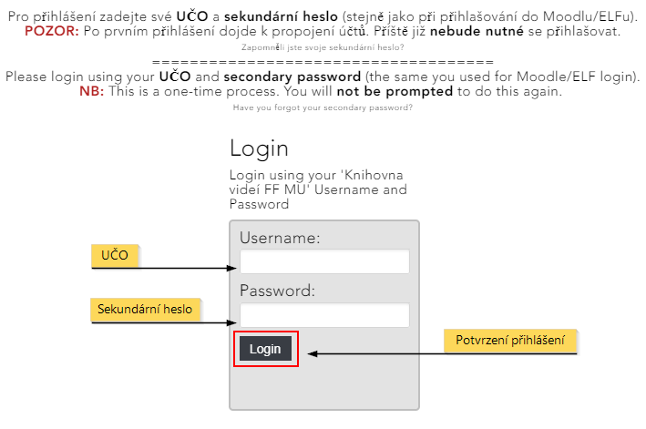

Propojení s Moodlem
===================

2.  [**2** První přihlášení a propojení
    účtů](#TOC-Prvn-p-ihl-en-a-propojen-t-)
3.  [**3** Medial vs. vložit
    multimédia](#TOC-Medial-vs.-vlo-it-multim-dia)

Jednou z předností Medialu je jeho propojení s prostředím pro
e-learningové kurzy [Moodle](http://elf.phil.muni.cz){:target="_blank"}. Díky němu můžete
využít všech výhod mediální knihovny, aniž byste opustili svůj kurz.

#### Přístup do Medialu

Přístup do Medialu je zajištěn dvojím způsobem: jednak prostřednictvím
zeleného **tlačítka Medial** (obr. 1), které je součástí HTML editoru a
pomocí kterého můžete vkládat videa a zvukové nahrávky do všech
obvyklých modulů, a jednak prostřednictvím **videoúkolu**, který
studentům umožňuje odevzdávat řešení úkolu v podobě nahrávky z Medialu.
Tlačítko Medial i videoúkol otevřou okno se zjednodušeným rozhraním
Medialu, díky kterému budete moci do své knihovny přidávat obsah,
procházet jej a vkládat do Moodlu.

Obr. 1: Tlačítko Medial v HTML editoru

V obou případech budete moci buď nahrát do kurzu (a zároveň do Medialu)
[nový obsah](/home/jak-vkladat-obsah-prostrednictvim-moodlu), nebo do
kurzu [vložit již existující
nahrávku](/home/jak-muazu-sva-videa-sirit#TOC-Sd-len-obsahu-v-Moodlu) z
Medialu.

#### 

Při prvním přístupu z Moodlu do Medialu budete muset zadat své
přihlašovací údaje v podobě UČO a sekundárního hesla (obr. 2). Po tomto
prvním přihlášení se Vaše účty v obou systémech spárují a při dalších
přístupech tak již přihlášení nebude nutné.

**Poznámka:** Propojení účtů je nutné i pro zobrazení videí vložených do
Moodlu -- i studenti se tedy budou muset napoprvé přihlásit.

Obr. 2: Úvodní přihlášení do Medialu

Ze svého kurzu pak budete mít přístupný stejný obsah jako z webu
Medialu. Moodle si navíc ke vkládaným videím dovede nastavit přístupová
práva, takže vložíte-li do kurzu své soukromé video, studenti si jej
v rámci kurzu budou moci přehrát, aniž byste jej museli zveřejňovat.
Mimo kurz přitom bude nahrávka nadále nedostupná.

#### Medial vs. vložit multimédia

Oproti [klasickému vkládání
multimédií](http://moodledocs.phil.muni.cz/editace-textu/vkladani-medii/vkladani-zvukovych-nahravek-a-videi){:target="_blank"}
nabízí Medial řadu výhod. V prvé řadě můžete mít všechny své nahrávky na
jednom místě, snáze si tak o nich udržovat přehled a pohodlněji je
spravovat. Všechny změny provedené v knihovně médií se navíc přenáší do
vložených videí v kurzu: pokud tedy například nahradíte nahrávku za
jinou nebo vložíte k nahrávce titulky, projeví se změny téměř okamžitě
ve všech kurzech, ve kterých jste tuto nahrávku použili. Vkládání z
Medialu Vám navíc nabízí více možností přizpůsobení. Můžete si například
vybrat, v jaké velikosti se nahrávka na stránce zobrazí, zda se zobrazí
i její popisek či zda si ji studenti budou moci z kurzu stáhnout. V
neposlední řadě pak lze v Medialu uchovávat mnohem větší soubory (až do
10 GB), což zejména oceníte, pokud chcete do kurzů vkládat delší videa
ve vysoké kvalitě.

#### Časté dotazy (FAQ)

**K jakým videím se z Moodlu dostanu?**

Při přístupu do Medialu prostřednictvím Moodlu se dostanete ke všem
videím, která byste měli přístupná ve webovém rozhraní Medialu.
Standardně to tedy budou nahrávky ve veřejných kategoriích, nahrávky
ze zaměstnaneckých kategorií Vašeho pracoviště a Vaše osobní nahrávky.
Všechna tato videa budete také moci vložit do svého kurzu, pouze svá
vlastní videa však budete moci prostřednictvím Moodlu také editovat.

**Mohou videa z Medialu vkládat do kurzu i studenti?**

Z bezpečnostních důvodů nemají studenti možnost používat v kurzech
embedovací kódy, a tedy nemohou ani vkládat obsah z Medialu. Mohou ovšem
odevzdávat úkoly v podobě nahrávek z Medialu, pokud v nastavení Úkolu
povolíte možnost "odevzdat video".
