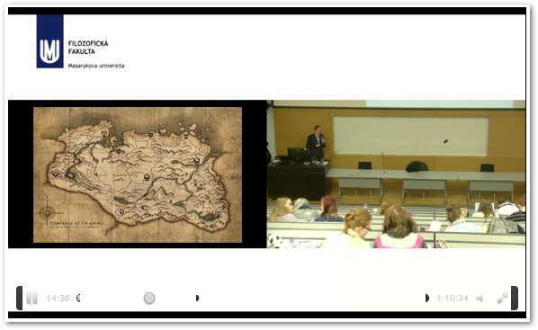
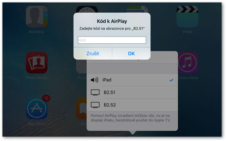

Tlačítkové panely
=================

>
>Návod platí pro učebny:
>
> -   **A11, A21, A24, A31,**
> -   **B2.52, B2.41, B2.42, B2.21, B2.22 a B2.32**,
> -   **C11, C32, C33, C34, C41, C42, C43,**
> -   **D22, D32, D33, D42, D43,**
> -   **G01, G02, G12, G23, G24, G25, G31, G32,**
> -   **J21, J22, J31,**
> -   **M11, M21, M22,**
> -   **N41, N51.**

Automatizované nahrávání je dostupné ve většině rekonstruovaných učeben
FF. Některé učebny jsou řešeny nahráváním pomocí tlačítkových panelů,
jiné pomocí [dotykových panelů](/medialdocs/dotykove-panely). Oboje
zařízení pak uživateli dovoluje jednoduše a pohodlně nahrát svou
přednášku, včetně materiálů promítaných na plátně. Přednášku je však
možné nahrát i bez těchto materiálů. Tento návod se věnuje učebnám s
tlačítkovými panely.

Obr. 1: Učebny jsou vybaveny tlačítkovými panely v různých variantách.

## Ovládání záznamového zařízení

Při používání zařízení pro automatizovaný záznam postupujte následujícím
způsobem:

1.  Přihlaste se k počítači v učebně. Tlačítko **"Záznam"/"Record"**
    na ovládacím panelu se bíle rozsvítí.
2.  Zapněte projektor a zvolte zdroj obrazu ([viz
    níže](/medialdocs/tlacitkove-panely#zapnuti-projektoru-a-volba-vstupu)).
3.  Stiskněte tlačítko "Záznam". Tlačítko se rozsvítí červeně na
    znamení, že probíhá nahrávání.
    **Pozor!** Zpracovány jsou pouze nahrávky, které trvají déle než
    jednu minutu. Kratší záznamy systém automaticky maže.
4.  Pro ukončení nahrávání znovu stiskněte tlačítko
    "Záznam"/"Record".
5.  Nahrávka se automaticky zpracuje a odešle do Vaší [osobní
    kategorie](/medialdocs/kdo-muaze-videt-muaj-obsah) ve fakultní
    knihovně médií [Medial](http://medial.phil.muni.cz){:target="_blank"}. Jakmile bude
    video dostupné, obdržíte e-mail s odkazem.

Jak nastavit oprávnění ke zhlédnutí videa v Medialu či jak lze videa z
Medialu dále šířit se dozvíte v [uživatelské
dokumentaci](/medialdocs/jak-muazu-sva-videa-sirit/){:target="_blank"}.
Mějte na paměti, že video se odešle do osobní složky v Medialu tomu
uživateli, který je během záznamu přihlášený na PC. Videa z učeben navíc
v Medialu nemají vyplněné doplňující informace, doporučujeme je proto
[dodatečně editovat](/medialdocs/jak-muazu-dodatecne-upravit-metadata),
aby je bylo možné v knihovně médií rozpoznat a dohledat.

**Poznámka.** Aby byl přednášející dobře slyšet, doporučujeme použít
některý z mikrofonů, které jsou v každé učebně k dispozici. Více o
mikrofonech se dozvíte v [patřičné sekci
dokumentace](/medialdocs/mikrofony).

Jak záznam vypadá? Přednášejícího snímá kamera napevno umístěná v
učebně. Je-li zapnutý projektor, vloží se obraz promítaný na plátno
přímo do videa, aby byla zajištěna dobrá čitelnost prezentací a jiných
výukových materiálů (obr. 2).

Obr. 2: Vzhled výsledného videa

### Zapnutí projektoru a volba vstupu

Pro zapnutí projektoru stiskněte tlačítko **"On**" nebo **"Audio
Only"** (zapne techniku v učebně, ale ponechá vypnutý projektor) na
ovládacím panelu. V učebnách lze promítat obraz z několika různých
zdrojů, pro výběr konkrétního vstupu přitom stačí stisknout příslušné
tlačítko.

Hlasitost lze ovládat pomocí otočného kolečka. Úroveň hlasitosti značí
svítící kontrolky.

V některých učebnách je navíc k dispozici tlačítko
**"Zmrazit"/"Freeze"** (zmrazí promítaný obraz, dokud jej znovu
neodmrazíte) nebo **"Mute"** (ztlumí zvuk přehrávaný z reproduktorů).

### Projekce z počítače v učebně

Projekci z počítače umístěného na katedře aktivujete stisknutím tlačítka
**"PC"**.

### Projekce z vlastního notebooku

Vlastní notebook můžete připojit pomocí rozhraní VGA či HDMI. Potřebné
konektory naleznete v zásuvce zapuštěné v desce katedry. Po zapojení
konektoru do notebooku stiskněte příslušné tlačítko na ovládacím panelu.

Obr. 3: Konektory pro připojení vlastního notebooku

Rozhraní **HDMI** umožňuje přenášet zvuk i obraz v digitálním formátu.
Kvalita obrazu je zpravidla vyšší než u VGA, ovšem při přenosu může
docházet k drobným prodlevám.

Rozhraní **VGA** je starší analogový standard, který slouží pouze k
přenosu obrazu. Pro přenos zvuku je nutné zapojit zvlášť konektor
**audio jack**. Kvalita obrazu může být nižší než u HDMI.

### Projekce ze zařízení Apple

Učebny v budovách A a B2 jsou vybaveny zařízením Apple TV, které
umožňuje bezdrátový přenos obrazu ze zařízení Apple. Snadno tak můžete
promítat obraz například z vlastního iPadu nebo MacBooku. Pro připojení
k Apple TV postupujte následujícím způsobem:

1.  Stiskněte tlačítko "Apple TV" na ovládacím panelu.

2.  V ovládacím centru svého zařízení Apple stiskněte tlačítko
    "AirPlay".

    
    Obr. 4: Tlačítko AirPlay v ovládacím centru
    

3.  Zobrazí se Vám seznam dostupných zařízení, pojmenovaných podle
    učebny, ve které se nacházejí. Zvolte to, na které chcete obraz
    přenášet.

    
    Obr. 5: Seznam dostupných Apple TV
    

4.  Zadejte kód, který se Vám zobrazí na promítací ploše, a potvrďte
    stisknutím "Ok". Obě zařízení se následně spárují.

    
    Obr. 6: Pole pro zadání kódu k Apple TV

### Projekce z vizualizéru

Učebny v budovách A a B2 jsou vybaveny vizualizérem, který funguje jako
kamera snímající určité místo na katedře a umožňuje tak promítat
například materiály vytištěné na papíře. Vstup z vizualizéru zvolíte
tlačítkem **"DOC CAM**". Vizualizér je buď umístěný na kraji katedry
(ovládat jej lze pomocí tlačítek na těle vizualizéru), nebo zavěšený
přímo nad katedrou (pak lze k ovládání využít dálkový ovladač uložený v
katedře).

## Kontrola funkčnosti zařízení v učebně

Správnou funkčnost záznamového zařízení si můžete ověřit přímo v učebně.
Na ploše učitelského PC je umístěna ikona **"OBS Studio"**, po jejím
rozkliknutí se otevře okno s náhledem záznamu z učebny. Zde si můžete
zkontrolovat, zda je obraz kamery v pořádku, zda je obraz z projektoru
vložený do záznamu a také zda je zaznamenáván zvuk. Úroveň snímaného
zvuku je indikována vizuálně pomocí svítícího ukazatele pod obrazem z
učebny.

Pokud náhled není v pořádku, [kontaktuje](/medialdocs/kontakty) techniky
CIT.

Náhled streamu můžete na učitelském PC otevřít kdykoliv i bez toho,
abyste spouštěli samotný záznam.

## FAQ

**Co dělat, když záznam spustím nedopatřením?**

Ke zpracování se odesílají pouze záznamy, které trvají déle než minutu.
Pokud jste tedy záznam vypnuli dříve, nemusíte nic řešit. V opačném
případě můžete počkat, až se video zpracuje, a poté jej z mediální
knihovny [odstranit](/medialdocs/kde-najdu-vsechna-svoje-videa).

**Co se stane, když záznam zapomenu ukončit?**

Nic se neděje, nahrávání se samo ukončí poté, co se odhlásíte z počítače
nebo jej vypnete.

**Tlačítko "Záznam" je zašedlé a nereaguje.**

Ověřte, zda jste přihlášení na počítači v učebně.

**Tlačítko "Záznam" svítí, přestože ještě nikdo není přihlášený na
počítači.**

Propojení s účtem zřejmě nefunguje správně a Vaše video by mohlo být
přiřazeno někomu jinému. Pokud můžete, kontaktujte techniky CIT (klapka
**1542**). Pokud nezbývá čas a záznam nutně potřebujete, zkuste se
nejprve přihlásit a znovu odhlásit a poté záznam spustit. V podobných
případech nám po ukončení záznamu
[napište](https://it.muni.cz/phil/ke/kontakty#main){:target="_blank"} -- ověříme, že
záznam skončil ve správné kategorii.

**Nepřišel mi mail s informací o zpracování záznamu.**

Zkuste ještě chvíli počkat, zpracování záznamu může trvat i několik
hodin. Pokud mail nepřijde do druhého dne,
[napište](https://it.muni.cz/phil/ke/kontakty#main){:target="_blank"} nám mail a uveďte v
něm, kdy a v jaké učebně jste nahrávku pořizovali.

**V učebně je místo tlačítka "Záznam" pouze "Mute".**

V těchto učebnách není zařízení pro automatizovaný záznam
nainstalované.

**Mohu v průběhu přednášky přepínat mezi vstupy? Odrazí se přepínání i
ve výsledném záznamu?**

Ano, v záznamu se vždy objeví právě ten vstup, který jste v dané chvíli
v učebně používali.
