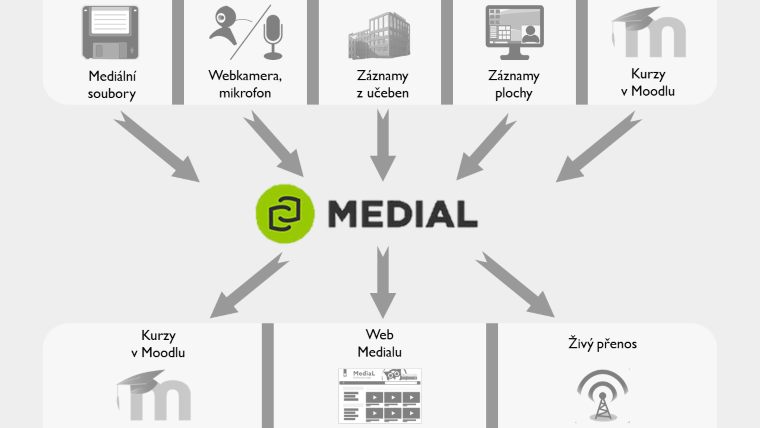

Využití Medialu
===============

#### 

<figure markdown><figcaption>Popisek</figcaption></figure>

Obr. 1: Znázornění využití Medialu.

Medial lze využívat jednoduše k zálohování a skladování videí a
zvukových nahrávek, které souvisí s činností jednotlivých pracovišť FF
MU. Nabízí však i jiné možnosti využití, které jsou ještě rozšířeny
integrací s dalšími e-learningovými systémy filozofické fakulty. Obr. 1
znázorňuje, jak můžete do Medialu přidávat obsah a jakými cestami můžete
tento obsah zprostředkovat ostatním.

-   **Mediální soubory:** do Medialu lze nahrát audio- a videosoubory
    běžných formátů jako jsou MP4, AVI, MP3, WAV a další. Průvodce
    přidáváním obsahu spustíte tlačítkem Upload na hlavní stránce.
    Podrobný návod najdete
    [zde](/home/jak-nahrat-do-medialu-soubor-z-pocitace).
-   **Webkamera, mikrofon:** díky Medialu můžete snadno vytvářet vlastní
    nahrávky pomocí webkamery nebo mikrofonu. Použít můžete třeba i
    kameru ve svém notebooku nebo -- přes mobilní verzi stránek --
    fotoaparát svého tabletu či telefonu. Podrobný návod najdete
    [zde](/home/jan-nahrat-video-pomoci-webkamery).
-   **Záznamy z učeben:** záznamy pořízené automatizovaným nahrávacím
    zařízením ve vybavených učebnách se po ukončení nahrávání a
    zpracování odešlou přímo do Vaší [osobní
    kategorie](/home/jak-je-obsah-v-medialu-organizovan#TOC-Kategorie-a-podkategorie)
    v Medialu.
-   **Výukové tutoriály:** pomocí nástroje [Techsmith
    Relay](http://relaydocs.phil.muni.cz/){:target="_blank"} můžete vytvářet pracovní
    návody a výukové tutoriály nebo třeba komentované výukové
    prezentace. Hotové nahrávky pak můžete odeslat k uložení přímo do
    Medialu.
-   **Kurzy v Moodlu:** v neposlední řadě můžete do Medialu přidávat
    obsah přímo ze svých kurzů v Moodlu. Takto můžete vkládat mediální
    soubory nebo vytvářet vlastní nahrávky. Popis propojení obou systémů
    naleznete [zde](/home/propojeni-s-moodlem), podrobnější postup pak v
    [tomto návodu](/home/jak-vkladat-obsah-prostrednictvim-moodlu).

Jak můžete obsah Medialu zveřejnit?

-   **Kurzy v Moodlu:** obsah z Medialu můžete snadno vkládat do svých
    kurzů v Moodlu, zároveň můžete studentům zadat, aby odevzdávali
    vlastní A/V nahrávky z Medialu jako řešení úkolu.
-   **Web Medialu:** své nahrávky můžete zveřejnit přímo na webu
    Medialu, přičemž můžete ovlivnit, kdo je bude moci zhlédnout. Z webu
    Medialu můžete svá videa také nasdílet jiným osobám, na jiné weby
    nebo si je stáhnout k sobě do počítače. Podrobný návod najdete
    [zde](/home/jak-muazu-sva-videa-sirit).
-   **Živý přenos:** přednášky z učeben v mohou být i živě vysílány,
    takže je konkrétní uživatelé (případně veřejnost) mohou sledovat
    přímo na webu Medialu. Pokud chcete této možnosti využít,
    [kontaktujte
    nás](http://e-learning.phil.muni.cz/jak-nas-kontaktovat){:target="_blank"} s
    dostatečným předstihem, vše potřebné pro Vás zařídíme, vysvětlíme
    vám celý postup a budeme k dispozici při spuštění přenosu přímo v
    učebně.

#### Scénáře užití

Nenapadá Vás, jak byste mohli Medial (a video nahrávky obecně) využít?
Pro inspiraci nabízíme alespoň několik obvyklých scénářů užití. Seznam
by samozřejmě mohl pokračovat -- nezapomeňte, že díky propojení Medialu
s dalšími součástmi e-learningového prostředí FF MU (ELF) se Vám nabízí
poměrně pestrá škála možností, jak audiovizuální materiály vytvářet,
zveřejňovat a používat ve vlastní výuce nebo třeba k propagačním
účelům.

**Mám k dispozici několik souborů s videi, které chci zálohovat na
jednom místě tak, abych k nim měl kdykoliv přístup.**

Toto je nejzákladnější způsob využití Medialu. Jednoduše
[nahrajte](/home/jak-nahrat-do-medialu-soubor-z-pocitace) svá videa do
Medialu a zařaďte je do
[kategorie](/home/jak-je-obsah-v-medialu-organizovan) podle toho, kdo by
k nim měl mít přístup. Videa pak budete moci zhlédnout přímo v Medialu,
dále je sdílet nebo si je z Medialu zase stáhnout.

**
**

**Mám k dispozici soubor s videem a chci jej umístit do svého kurzu v
Moodlu.**

Pomocí [tlačítka Medial v HTML
editoru](/home/jak-vkladat-obsah-prostrednictvim-moodlu) Moodlu můžete
nahrát video do Medialu a zároveň jej vložit do svého kurzu, aniž byste
vůbec opustili pracovní prostředí Moodlu.

**Chci zaznamenat svou přednášku a zveřejnit ji pro všechny studenty
Filozofické fakulty.
**Pomocí automatizovaného nahrávacího systému v učebnách fakulty můžete
snadno zaznamenat své přednášky. Nahrávání spustíte a ukončíte pouhým
stisknutím tlačítka a hotový záznam se poté objeví ve Vaší osobní
kategorii v Medialu. Video můžete poté zveřejnit [vybraným skupinám
uživatelů](/home/kdo-muaze-videt-muaj-obsah) přímo na webu Medialu.

**Chci zaznamenat svou přednášku a zpřístupnit ji v Moodlu pouze svým
studentům.**

Svá videa nemusíte zveřejňovat. Své osobní a soukromé nahrávky můžete
[vložit do kurzu v Moodlu](/home/jak-muazu-sva-videa-sirit), kde je
budou moci zhlédnout pouze studenti, kteří jsou v kurzu zapsaní. Na webu
Medialu zůstane Vaše video nepřístupné.

**Chci nahrát výukový materiál s ukázkou správné výslovnosti a
zprostředkovat jej studentům.**

Medial nejsou jenom videa -- pracovat můžete i se zvukovými nahrávkami,
které můžete také [pořizovat pomocí vlastního
mikrofonu](/home/jan-nahrat-video-pomoci-webkamery).

**Chci nahrát průběh konference a zpřístupnit jej široké veřejnosti.
** Umístíte-li záznam do [veřejné
kategorie](/home/kdo-muaze-videt-muaj-obsah), bude přístupný všem
návštěvníkům Medialu, včetně neregistrovaných hostů.

**Chci zaznamenat průběh kulturní akce a zpřístupnit jej pouze jejím
účastníkům.
** Video můžete ponechat ve své osobní kategorii a konkrétním lidem [na
ně poslat odkaz](/home/jak-muazu-sva-videa-sirit). Pouze lidé s přímým
odkazem se k videu dostanou.

**Chci vytvořit výukový tutoriál se záznamem plochy a umístit jej do
svého kurzu v Moodlu.
** Pomocí nástroje [Techsmith Relay](http://relaydocs.phil.muni.cz/){:target="_blank"}
můžete vytvářet výukové tutoriály se záznamem plochy. Videa z Relaye se
uloží do Vaší kategorie v Medialu, odkud je můžete snadno vložit do
svého kurzu.

**Chci zaznamenat interní poradu na svém pracovišti, zpřístupnit ji
pouze svým kolegům a záznam rozdělit do kapitol podle probíraných bodů.
** Umístíte-li nahrávku do [zaměstnanecké
kategorie](/home/kdo-muaze-videt-muaj-obsah) svého pracoviště, uvidí ji
v Medialu pouze zaměstnanci tohoto pracoviště. U svých videí také můžete
[nastavit
kapitoly](/home/jak-muazu-dodatecne-upravit-metadata#TOC-Jak-u-nahr-vek-nastavit-kapitoly),
které umožní přeskočit rovnou na konkrétní čas nahrávky.

**Chci zaznamenat vystoupení hostujícího přednášejícího, streamovat
je případným zájemcům živě a poté záznam zveřejnit v kurzu v Moodlu.
** Při použití automatizovaného nahrávacího systému v učebnách fakulty
můžete povolit, aby nahrávanou přednášku mohli uživatelé Medialu
sledovat v přímém přenosu -- třeba i ze svého domova. Po ukončení a
zpracování záznamu se nahrávka objeví ve Vaší kategorii v Medialu.

#### Rozcestník rychlé nápovědy

medial-rozcestnik

