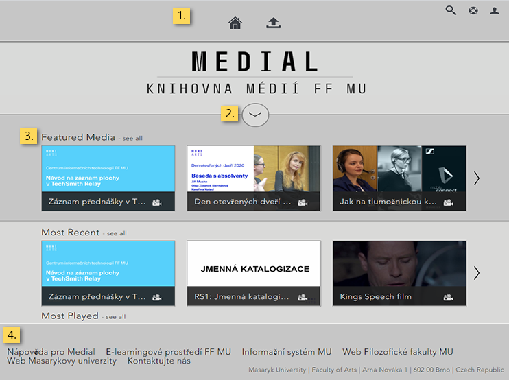

Základní orientace
==================

2.  [**2** Knihovna médií a Správa
    médií](#TOC-Knihovna-m-di-a-Spr-va-m-di-)

#### Přihlášení do Medialu

Pro přihlášení klikněte na tlačítko "Sign in" v pravém horním rohu
domovské stránky Medialu. Načte se Vám přihlašovací formulář -- jako
přihlašovací údaje použijte své UČO (kolonka "Username") a sekundární
heslo (kolonka "Password"). Přihlášení potvrdíte tlačítkem "Login".

Obr. 1: Přihlašovací dialog

Po přihlášení budete moci do Medialu přidávat vlastní obsah. V
závislosti na právech Vašeho účtu získáte také přístup k nahrávkám,
které nejsou veřejně přístupné, jako např. k zaměstnaneckým videím svého
pracoviště nebo videím ve své osobní kategorii.

**Pozor!** Přihlášení do Medialu je umožněno pouze zaměstnancům a
studentům Filozofické fakulty a uživatelům spolupracujících pracovišť v
rámci MU. Zaměstnanci a studenti jiných fakult a pracovišť MU mohou v
případě zájmu o využívání systému kontaktovat [správce
systému](https://it.muni.cz/phil/ke/kontakty#main){:target="_blank"}.

#### Knihovna médií a Správa médií

Pracovní prostředí Medialu tvoří dva propojené systémy, mezi nimiž
můžete při práci libovolně přecházet. V rámci každého z nich je možné
provádět různé akce, oba jsou také vizuálně odlišeny.

Obr. 2: Záhlaví knihovny videí a správy videí

**Knihovna médií** umožňuje procházet, vyhledávat a zobrazovat obsah
uložený v Medialu. Je přístupná všem návštěvníkům webu včetně
nepřihlášených hostů, ovšem až po přihlášení v ní naleznete i videa
z neveřejných kategorií, ke kterým máte přístup.

**Správa médií** umožňuje obsah do Medialu přidávat a spravovat jej.
Toto rozhraní je přístupné pouze přihlášeným uživatelům.

Z knihovny videí se do rozhraní pro správu dostanete pomocí volby "My
Content" v rozbalovací nabídce **My Account**. Ze správy videí se zpět
do knihovny dostanete přes tlačítko "Home" v navigační liště.

#### Navigace v knihovně médií

Po přihlášení do Medialu se ocitnete na domovské stránce knihovny médií.
Naleznete zde základní prvky pro procházení obsahu knihovny.

Obr. 3: Domovská stránka knihovny videí

1.  **Navigační lišta**: obsahuje odkazy na některé klíčové stránky
    Medialu

-   **Domů**: ikona domečku vede zpět na domovskou stránku knihovny
    médií
-   **Upload**: otevře rozhraní pro přidávání obsahu
-   **Search**: otevře pole pro vyhledávání
-   **Help**: obsahuje základní nápovědu pro Medial
-   **My account**: zobrazí nabídku ke správě uživatelského obsahu

**Kategorie **(Categories): nejsou primárně zobrazeny a je třeba
rozkliknout šipku

**Soupis videí**: domovská stránka zobrazuje aktuálně dostupná videa; na
hlavní stránce se zobrazují některé výběrové seznamy jako Naposledy
přidané (Latest Added), Nejpřehrávanější (Most Played) a Náhodný výběr
(Random)

**Odkazy** (Links): na konci domovské stránky se nachází sekce s
užitečnými odkazy na jiné weby

#### Hledání nahrávek

Obr. 4 : Vyhledávací pole s aktivním našeptáváním

Pro vyhledání konkrétní nahrávky použijte vyhledávací pole v navigační
liště. Zadaný text bude vyhledán v názvech a popiscích nahrávek, v
klíčových slovech, názvech
[kapitol](/medialdocs/jak-muazu-dodatecne-upravit-metadata#TOC-Jak-u-nahr-vek-nastavit-kapitoly)
a také ve jménech autorů. Vyhledávání pracuje s **funkcí našeptávání**
-- již při zadávání dotazu Vám tedy Medial ukáže návrhy odpovídající
Vašemu dotazu. Pro vyhledávání pomocí neúplných slov je třeba použít
zástupný znak * (např. "středově*" dohledá výrazy "středověk",
"středověcí" apod.).

#### Filtrování obsahu

Obr. 5: Sloupec s použitelnými filtry

Filtrování Vám umožní zobrazit v seznamu videí pouze ta, která Vás
zajímají. Obsah Medialu lze filtrovat podle tří položek: [kategorií a
podkategorií](/medialdocs/jak-je-obsah-v-medialu-organizovan), autorů a
[tagů](/medialdocs/jak-je-obsah-v-medialu-organizovan#TOC-Tagy).
Jednotlivé položky lze vzájemně kombinovat, v rámci každé z nich můžete
ovšem nastavit jen jediný filtr. Můžete si tedy zobrazit například
všechna videa nahraná konkrétním uživatelem v rámci určité podkategorie,
nelze však už zobrazit obsah dvou podkategorií najednou.

Použitý filtr kategorie se zobrazí v horní části stránky. Seznam
použitelných filtrů se přizpůsobuje tomu, které filtry již máte
aktivované: pokud tedy zvolíte jako filtr určitou podkategorii, zobrazí
se Vám v nabídce tagů pouze ty, které jsou v dané podkategorii užity.

Chcete-li některý aktivní filtr zrušit, stačí kliknout na ikonku
červeného křížku u jeho názvu.

#### Časté dotazy (FAQ)

**Je možné mít uživatelské rozhraní v češtině?**

Čeština prozatím není mezi jazyky, které Medial podporuje, do budoucna
však plánujeme uživatelské rozhraní do češtiny přeložit.
