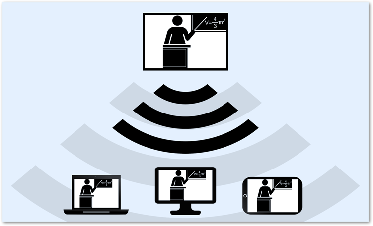
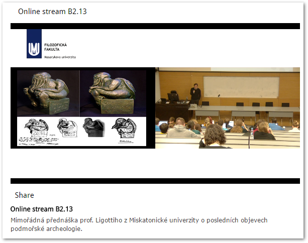
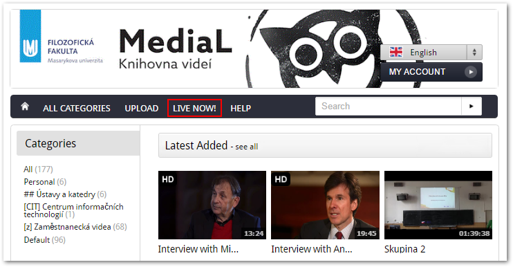
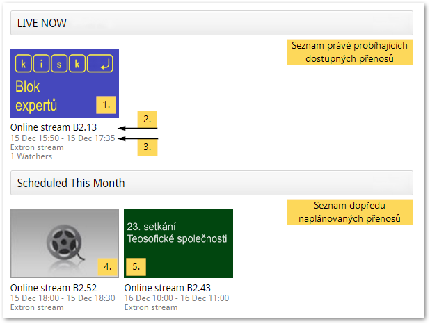

Živý přenos (Live Stream)
=========================

1.  [**1** Co je to streamování a jak
    funguje?](#TOC-Co-je-to-streamov-n-a-jak-funguje-)

####  

#### Co je to streamování a jak funguje?

> Obr. 1: Schéma streamování: z učebny na elektronická zařízení
> 

V učebnách vybavených automatizovaným nahrávacím systémem můžete své
přednášky nejen zaznamenávat, ale také streamovat přes internet.
Streamování můžete chápat jako živé vysílání, díky kterému je možné dění
v učebně sledovat i online. Svou přednášku tak můžete zprostředkovat i
lidem, kteří by se jí např. z kapacitních důvodů nemohli zúčastnit
osobně.

Potřebnou technikou pro streamování v současné době disponují učebny v
budovách Carly (A a B2).

Streamované video vypadá stejně jako záznam z učebny (viz obr. 2).
Přednášejícího snímá kamera napevno umístěná v učebně. Pokud je zapnutý
projektor, vkládá se promítaný obraz přímo do videa, takže je zajištěna
dobrá čitelnost prezentací a dalších podpůrných materiálů. Aby byl
přednášející dobře slyšet, doporučujeme použít některý z
[mikrofonů](/mikrofony) umístěných v katedře.

> Obr. 2: Video s živým přenosem
> 

#### Co je třeba zařídit?

Na rozdíl od záznamu, který mohou obsloužit sami vyučující, nastavují
streamování z učeben pracovníci Kanceláře e-learningu FF MU. Pokud
chcete využít možnosti živého přenosu, stačí s dostatečným předstihem
(alespoň tři dny předem) napsat e-mail na <elf@phil.muni.cz>, a my pro
Vás vše potřebné nastavíme. V e-mailu nezapomeňte uvést především kdy a
ve které učebně se bude přednáška konat a přesný čas, po který má být
stream k dispozici. 

Pokud budete chtít, můžete nám poslat i krátký doprovodný text a
náhledový obrázek, který ke streamu připojíme a který případným divákům
usnadní orientaci..

#### Jak stream sledovat?

Živé přenosy z učeben lze sledovat v rámci fakultní knihovny médií
[Medial](http://medial.phil.muni.cz). Jsou-li nějaké streamy
k dispozici, objeví se v navigační liště Medialu tlačítko "Live Now!",
pomocí nějž se dostanete na seznam dostupných přenosů.

**Poznámka.** Pokud je v navigační liště místo tlačítka "Live Now!"
pouze "Live", znamená to, že jsou některé přenosy naplánované, ale
momentálně žádný neprobíhá.

> Obr. 3: Tlačítko "Live Now!" zobrazí seznam dostupných streamů
> 

Jednotlivé přenosy jsou pojmenovány podle učebny, ze které jsou
vysílány. Orientovat se můžete také podle času, na který je streamování
naplánováno, nebo podle náhledového obrázku, pokud je připojen. Výběrem
konkrétního streamu spustíte jeho přehrávání.

Sekce "Scheduled This Month" ("Naplánováno na tento měsíc") obsahuje
přenosy, které jsou naplánované, ale zatím nedostupné. U každého z nich
najdete informaci o tom, od kdy do kdy bude přístupný.

> Obr. 4: Seznam dostupných a naplánovaných streamů
> 

1.  Právě probíhající stream
2.  Označení učebny, ze které je přenos vysílán
3.  Čas, po který bude stream dostupný
4.  Naplánovaný stream (bez náhledového obrázku)
5.  Naplánovaný stream (s náhledovým obrázkem)

Stream je přístupný všem návštěvníkům Medialu, tedy i nepřihlášeným
hostům.

#### Časté dotazy (FAQ) 

**V navigačním panelu není tlačítko Live ani Live Now!**

Přenos zřejmě ještě není nastavený.

**Místo streamu se mi zobrazuje nápis "This live channel is not
currently available."**

Stream v této chvíli není přístupný. Přesný čas přenosu zjistíte na
stránce se seznamem přenosů.

**Místo streamu se mi zobrazuje nápis "This video is secured and not
currently available to you."**

Ke sledování přenosu nemáte dostatečná oprávnění. Zkuste se přihlásit do
Medialu, případně
[kontaktujte](http://e-learning.phil.muni.cz/jak-nas-kontaktovat)
správce Elfu.

**Místo streamu se mi zobrazuje nápis "Error loading player: No
playable sources found."**

Pravděpodobně máte neaktuální zásuvný modul Flash. Nejnovější verzi
získáte na [stránkách společnosti
Adobe](https://get.adobe.com/cz/flashplayer/).

**Vytváří se při streamování automaticky záznam?**

Ne, pokud chcete streamovanou přednášku také nahrávat, je nutné ručně
spustit záznamové zařízení.

**Je možné streamovat přednášku z jedné učebny do druhé?**

Ano, stream z jedné učebny lze snadno promítat v jiné učebně. Je-li to
nutné, můžete takto vyřešit problémy s kapacitou učebny např. při
větších konferencích. 
